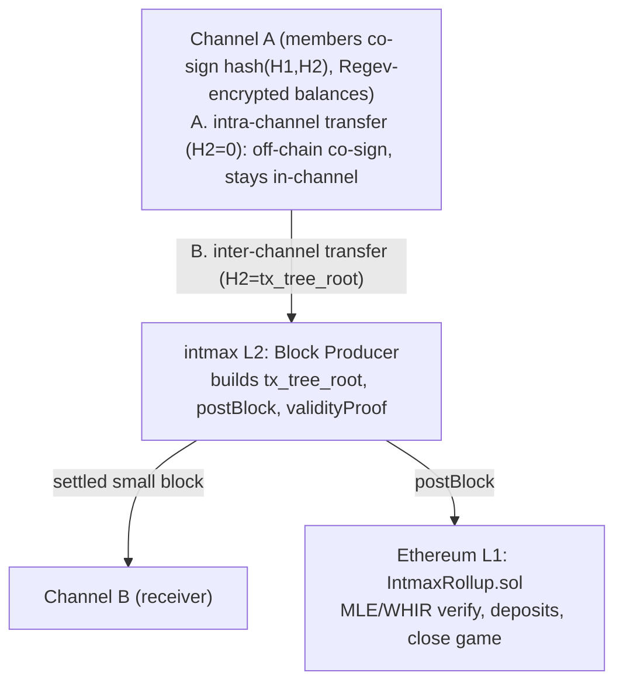
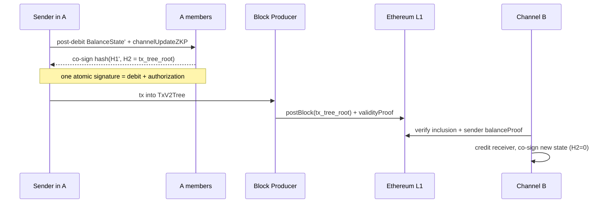

# INTMAX3 — a state-minimized and post‑quantum ZK rollup enshrining payment channels 

INTMAX3 is a confidential, quantum safe, fast, and scalable payment system on Etheruem. Channels hold **encrypted** balances (Regev/LWE), agree on state with
**post‑quantum** signatures, and pay **any other channel** through the rollup — so there is no
routing‑liquidity problem. This repository contains the proving circuits (Rust/Plonky2), the L1
settlement contracts (Solidity/Foundry), a machine‑checked safety proof (Lean), and a browser wallet.

---

## Why INTMAX3

- **L1 security + 1‑of‑N trust.** Every channel ultimately settles on Ethereum L1. Safety needs only
  **one honest party — you**: with the last all‑member‑signed state you can always `close` on‑chain,
  and `withdrawClaimZKP` lets you exit and withdraw **without any other member's cooperation**.
  
- **Strong statelessness & minimal block‑space use.** The rollup keeps **almost no per‑user state
  on‑chain** — users custody their own `balanceProof`s, and each block posts only a `tx_tree_root`
  (+ deposit hash chain). The on‑chain footprint per transfer is tiny, so throughput scales without
  bloating L1 state.
  
- **Full privacy.** Per‑member balances are **Regev/LWE ciphertexts** decryptable only by their owner;
  intra‑channel transfer amounts are encrypted to the recipient. The breakdown of who holds what
  inside a channel is hidden from the other members, the block producer, and L1 — yet solvency is still
  enforced by ZK range proofs (`channelTxZKP` / `channelUpdateZKP`), so confidentiality and
  "no over‑spend" coexist.
  
- **Post‑quantum.** State agreement uses **hash‑based signatures** (Poseidon‑hash sigs) and
  balances use **lattice (Regev/LWE)** encryption — both believed secure against quantum adversaries.
  
- **Fast finality.** In‑channel transfers finalize the instant the members co‑sign the new state
  (off‑chain, milliseconds of proving) — no on‑chain round‑trip per payment.
  
- **No capital‑efficiency problem.** Unlike Lightning‑style networks, you don't lock capital into
  pre‑funded bidirectional route capacity. **Any channel pays any channel** through the intmax rollup
  (`interChannelTransfer`) — no inbound‑capacity, path‑liquidity, or rebalancing cost.

---

## Protocol at a glance

The protocol is **MECE**: every transfer is exactly one of two kinds, distinguished structurally by an
`H2` tag in the signed state. Each kind is gated by a ZK range proof so balances stay encrypted while
remaining provably solvent. (Spec: [`doc/architecture-audit/abstract2.md`](doc/architecture-audit/abstract2.md).)



**Two transfer types**

| | A · intra‑channel (`H2 = 0`) | B · inter‑channel (`H2 = tx_tree_root`) |
|---|---|---|
| who | the N members of one channel | channel → channel, via the rollup |
| proof | `channelTxZKP` (recipient ct valid **and** sender post‑balance ≥ 0) | `channelUpdateZKP` (sender − / receiver + equal amount, sender ≥ 0, cts valid) |
| settlement | off‑chain co‑signature only (instant) | tx enters an L1 block; receiver verifies inclusion + the sender's `balanceProof` |

**The atomic signature (why a transfer can't grief co‑members).** Members never sign a bare
`tx_tree_root`; they sign `hash(H1', H2)` where `H1'` is the *post‑subtraction* balance state and `H2`
is the transfer tag. So "authorize the transfer" and "agree to the debit" are **one inseparable
signature** — a signature that authorizes the send but refuses the debit is undefined by construction.



**Five security properties** (formalized in §4 of the spec and machine‑checked in Lean):
1. **Authorization** — all‑member signature over `hash(H1,H2)`; an invalid state is never signed.
2. **No double‑spend / no illicit mint** — `commonState` + per‑block `validityProof`; close‑time
   `withdrawCap` caps total withdrawals; `settledTxChain` binds the state to its `balanceProof`.
3. **Solvency** — encrypted balances stay non‑negative inductively via the mandatory range ZKPs.
4. **Exit / liveness** — `requestClose → grace → challenge(latest‑version wins) → withdraw`; you exit
   alone with `withdrawClaimZKP`; late funds recovered via `lateBalanceProof`.
5. **Balance confidentiality** — Regev encryption hides per‑member balances from everyone.

---

## Usage

```bash
# Rust circuits — tests MUST run in release (debug builds are ignored via cfg_attr)
cargo build --release
cargo test --release                          # full suite
cargo test --test inter_channel_live --release -- --nocapture   # inter-channel send, no facade
cargo test --test e2e --release               # end-to-end rollup flow

# Solidity contracts (from contracts/)
cd contracts && forge install && forge test -vvv

# Browser wallet (proving runs in your browser via WASM + multi-threading)
bash hosting/build-wallet-wasm.sh              # build the wasm package (needs cdylib at invocation)
node hosting/wallet/wallet-relay.js            # https://localhost:8000/wallet-live.html (2 channels)
```

The browser wallet does the ZK proving locally; a small relay co‑signs as the other members. Join a
channel, send intra‑channel (same channel id) or inter‑channel (a different channel id). Deploying the
demo to Sepolia + AWS is documented in [`doc/docs/deploy-runbook.md`](doc/docs/deploy-runbook.md).

> Requires Rust nightly (pinned in `rust-toolchain.toml`) and Foundry. Tests use
> `#[cfg_attr(debug_assertions, ignore)]` — always pass `--release`.

---

## Repository layout

| Area | Path | What |
|---|---|---|
| **Specification** | [`doc/architecture-audit/detail2.md`](doc/architecture-audit/detail2.md) | the **authoritative implementation spec**; [`abstract2.md`](doc/architecture-audit/abstract2.md) is the minimal spec + the 5 security properties |
| **Audit** | [`doc/audit/zkp/`](doc/audit/zkp/) ([SUMMARY](doc/audit/zkp/SUMMARY.md)) | an **implementation‑level** Lean formalization of the actual Plonky2 circuits **and** L1 contracts (each gate/`require` transcribed line‑by‑line to a machine‑checked soundness theorem) — 225 theorems, zero `sorry`/`axiom`, `lake build` green — plus an **additional adversarial audit by Opus 4.8** built on top of it (meta‑audit + remediation; [report](doc/audit/audit02-07-2026.md)) |
| **Machine‑checked safety** | [`doc/architecture-audit/ChannelSafety.lean`](doc/architecture-audit/ChannelSafety.lean), [`ChannelSafety2.lean`](doc/architecture-audit/ChannelSafety2.lean) | Lean proofs of authorization / no‑double‑spend / solvency / exit safety for abstract(2).md, with crypto primitives modeled by their soundness contracts |
| **Proof circuits** | `src/circuits/` | `balance/` (account state via IVC), `validity/` (block consensus + Poseidon signature), `withdraw/`, `channel/` (channel state‑update verifiers) |
| **Lattice layer** | `src/regev/` | Regev/LWE keygen, encryption, and the channel‑tx / channel‑update STARKs (`channelTxZKP` / `channelUpdateZKP`) |
| **Signatures** | `src/poseidon_sig/` | Poseidon‑hash ZK signatures used for channel‑state co‑signing |
| **Core types** | `src/common/`, `src/ethereum_types/` | `BalanceState`, `ChannelTx`, `Block`, `Transfer`, Merkle trees; Ethereum‑compatible field types |
| **Wallet** | `src/wallet_core.rs`, `src/wasm_wallet.rs`, `hosting/wallet/` (`wallet-live.html`, `wallet-relay*.js`, …) | library + WASM entry points + browser UI + co‑signing relay |
| **L1 contracts** | `contracts/src/` | `IntmaxRollup.sol` (deposits, `postBlock`, close game), `@mle/MleVerifier.sol` (WHIR PCS, via the `polygon-plonky2` submodule), `ChannelSettlement*.sol`|
| **Tests** | `tests/` | e2e rollup (`e2e.rs`), inter‑channel (`inter_channel_{live,cli,e2e,unified_e2e,validity_b2}.rs`), on‑chain (`mle_onchain_e2e.rs`, `onchain_deposit_keystone.rs`), deposit backing (`channel_backing_e2e.rs`) |

**Key dependencies** (pinned to the `polygon-plonky2` submodule via Cargo `[patch]`):
`plonky2` / `starky` / `plonky2_mle` (FRI‑based STARKs + the multilinear PCS with **WHIR** used for the
on‑chain wrapper proof), `plonky2_bn254` / `plonky2_keccak` (BN254 + Keccak circuits),
`regev_plonky3` (the Regev/LWE lattice layer on Plonky3), and post‑quantum signatures.
Stack: Rust 2024 (nightly) + Solidity 0.8.29 (Foundry, Prague EVM).

---

## Benchmarks

```bash
cargo bench --bench proof_bench               # proving time: balance-processor proofs (initial,
                                              # receive-deposit, send-tx, receive-transfer),
                                              # deposit-hash-chain step, block-hash-chain step
cargo bench --bench degree_report             # per-circuit gate counts / degree (complexity report)
cargo test  --release regev_timing -- --nocapture   # Regev encrypt + channel-tx (E-1) prove/verify timing + proof size
```

`proof_bench` (Criterion) reports wall‑clock proving time per circuit; `degree_report` prints each
circuit's size so you can see where the cost is. Indicative figures observed on Apple‑silicon / a small
arm64 box (orders of magnitude, not a guarantee — run the benches for your hardware):

| Operation | Cost (indicative) |
|---|---|
| Regev channel‑tx (E‑1) proof, Production params | a few ms, ~KB‑scale proof |
| Channel co‑sign of a state update (relay member) | ~seconds, ~200 MB RAM |
| Full channel `balanceProof` (one‑time prover build) | ~25 s |
| Browser proving | multi‑threaded WASM (SharedArrayBuffer); needs COEP/COOP + a secure context |

WASM proving uses SIMD128 + a `wasm-bindgen-rayon` thread pool and lives within the wasm32 4 GB linear
memory limit (strategic `drop()`s keep peak under the cap).
