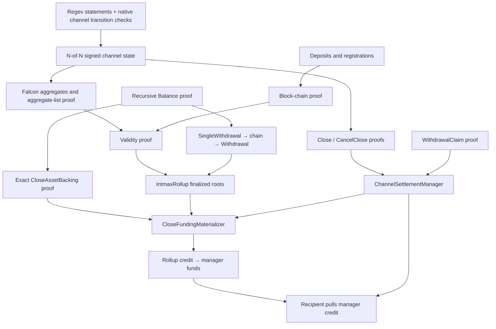

# Circuit and Contract Inventory, Responsibilities, and Missing Capabilities

**Project:** intmax3-zkp

**Review date:** 2026-09-26

**Source baseline:** commit `6ac46c98facfb8f734905937d46cb1649725c1c4`, with the working tree as inspected on the review date

**Document language:** English

**Purpose:** consolidate the circuit inventory, file-by-file explanations, contract inventory, and evidence-based discussion of missing capabilities into one document.

This is a source-based architectural explanation, not a claim that every cryptographic constraint, economic invariant, deployment, or operational path has been independently audited. Existing tests and comments are useful evidence of intent; neither is treated as proof that a feature is deployed or that an entire workflow is complete. No protocol code is changed by this document.

## Contents

1. [Scope, counts, and terminology](#1-scope-counts-and-terminology)
2. [System architecture and trust boundaries](#2-system-architecture-and-trust-boundaries)
3. [Balance circuits](#3-balance-circuits)
4. [Channel settlement circuits](#4-channel-settlement-circuits)
5. [Validity, registration, and deposit circuits](#5-validity-registration-and-deposit-circuits)
6. [Withdrawal circuits](#6-withdrawal-circuits)
7. [Generic recursion and historical circuits](#7-generic-recursion-and-historical-circuits)
8. [Falcon signature circuits](#8-falcon-signature-circuits)
9. [Regev and sender-signature STARKs](#9-regev-and-sender-signature-starks)
10. [Supporting circuit files and complete directory coverage](#10-supporting-circuit-files-and-complete-directory-coverage)
11. [Application contracts, file by file](#11-application-contracts-file-by-file)
12. [External verifier contracts](#12-external-verifier-contracts)
13. [Cross-layer workflows](#13-cross-layer-workflows)
14. [Missing capabilities and incomplete integration](#14-missing-capabilities-and-incomplete-integration)
15. [Features that should not be labeled missing](#15-features-that-should-not-be-labeled-missing)
16. [Completion priorities and acceptance criteria](#16-completion-priorities-and-acceptance-criteria)
17. [Source coverage and review limitations](#17-source-coverage-and-review-limitations)

## 1. Scope, counts, and terminology

### 1.1 What is being counted

There are **21 Rust files in the original circuit-filename inventory**: 20 files ending in `_circuit.rs` and the historical `src/deprecated/member_set_update/circuit.rs`. This is a filename classification, not the total number of proving statements.

| Group | Files in the original inventory |
|---|---:|
| Balance | 5 |
| Channel close, backing, cancellation, and claims | 5 |
| Validity and hash-chain wrappers | 4 |
| Withdrawal | 3 |
| Generic hash-chain recursion | 3 |
| Deprecated member-set update | 1 |
| **Total** | **21** |

An additional **12 files define standalone Plonky2 circuit types without those filenames**: the balance switchboard; deposit, registration, block, user-update, and withdrawal steps; five Falcon files; and the generic wrapper. Two further files contain the relevant Plonky3 AIR/STARK definitions.

Thus this document explains **35 principal proof-definition files**: 21 + 12 + 2. This does **not** mean 35 active production circuits:

- Some files contain several circuits or AIRs.
- Some circuits are wrappers or measurement/test-oriented harnesses.
- Some paths are historical, feature-gated, or disabled at the application boundary.
- Runtime selection and verifier-data pinning matter more than a filename.

There are **65 Rust source files under `src/circuits/`**, including module declarations, public-input types, witnesses, processors, shared constraints, and test helpers. Section 10 accounts for every one; files with substantive standalone proof definitions receive longer explanations in earlier sections.

### 1.2 Solidity inventory

There are **7 first-party Solidity source files under `contracts/src/`**. Their top-level declarations comprise **5 concrete contracts, 1 abstract legacy contract, 5 interfaces, and 1 library**. These are declaration counts, not a deployment count.

| File | Main declarations |
|---|---|
| `IntmaxRollup.sol` | `IntmaxRollup` |
| `ChannelSettlementManager.sol` | `ChannelSettlementManager`; three dependency interfaces |
| `ChannelSettlementVerifier.sol` | `ChannelSettlementVerifier` |
| `CloseFundingMaterializer.sol` | `CloseFundingMaterializer`; `LegacyTerminalChildFundingMaterializer` |
| `BlobKZGVerifier.sol` | `BlobKZGVerifierExt` |
| `SafeERC20.sol` | `IERC20`; `SafeERC20Lib` |
| `IPinnedMleVerifierV2.sol` | `IPinnedMleVerifierV2` |

Two important verifier contracts reside in the Polygon Plonky2 submodule and are explained separately: `PinnedMleVerifierV2.sol` and `MleVerifierV2.sol`.

For repository navigation, there are also **20 Solidity script files** and **56 Solidity test files**, giving **83 Solidity files across `contracts/src`, `contracts/script`, and `contracts/test`**, excluding `contracts/lib`. Scripts and tests are not 76 additional application contracts.

### 1.3 Terms used throughout

| Term | Meaning here |
|---|---|
| Circuit | A constrained Plonky2 statement, with verifier data identifying the accepted relation. |
| AIR/STARK | A Plonky3 execution-trace relation and its proof machinery. It is not automatically recursively verified by a Plonky2 circuit. |
| Gadget / Target | Constraints embedded inside a larger circuit; usually not independently deployed or verified. |
| Witness generator / processor | Host code constructing inputs and orchestrating proofs. Its validation is not a substitute for constraints. |
| Public inputs, or PIs | Values authenticated by a proof. Their interpretation, encoding, and binding to application arguments remain essential. |
| Verifier data, or VD | Circuit-specific verification material. Two circuits with the same PI layout need not accept the same statement. |
| N-of-N | Every active channel co-signer signs the same state digest. The active count, distinct keys, and registered member commitment must also be bound. |
| Channel member | A co-signer. This is different from a delegate holding an encrypted balance slot. |
| Extended public state | The base public state plus additional commitments needed by the validity and settlement system. |
| Signed head | A channel state authorized by its co-signers; authorization alone does not establish finality or exact base-asset backing. |
| Materialization | Moving authenticated channel funds from rollup escrow into a manager's withdrawable credit, once the required close and backing conditions hold. |

## 2. System architecture and trust boundaries

The implementation combines several proof systems and state machines. Understanding their joins is more useful than viewing every proof as interchangeable evidence of a universally valid channel.

### 2.1 Main layers

1. **Base-layer private accounting.** Balance proofs track private asset roots, sent transactions, received deposits/transfers, nullifiers, and the public state against which these changes were settled.
2. **Validity of published history.** Deposit, registration, and block chains establish successive public states. Falcon aggregate-list proofs authenticate the co-signer authorizations committed by that history.
3. **Channel-local encrypted accounting.** Regev STARKs prove specific encrypted-value relations. Native Rust transition verifiers compose them with metadata, token, slot, and state-linkage rules before co-signers authorize a state.
4. **Settlement proofs.** Close and cancel proofs authenticate channel states. An exact asset-backing proof joins a signed fund vector to a private Balance proof. Claim proofs open a particular encrypted payout entitlement.
5. **L1 custody and lifecycle.** Solidity checks pinned proofs, application bindings, finality, replay protection, challenge windows, escrow accounting, and actual transfers.



### 2.2 The most important boundaries

**Authorization, backing, and entitlement are separate statements.** A valid co-signer signature proves authorization of a digest. A backing proof establishes that the exact fund vector is represented by a Balance proof. A claim proves that a particular recipient owns a particular amount in the final encrypted state. Settlement needs the appropriate combination.

**Finality is an L1 fact.** A circuit can expose an extended-state commitment and anchor block. A contract must still establish that the rollup finalized that commitment and that the anchor is fresh enough for the channel's lifecycle.

**Channel-local validation is partly native.** The current design does not place every historical encrypted channel transition inside the final Plonky2 close proof. Co-signers validate transitions and sign the resulting state; the final proof authenticates their signatures and specified state relations. A requirement to remain safe against unanimous malicious authorization would be a stronger trust model and needs additional design.

**Proof bytes and application arguments must match.** Solidity must verify the exact compact proof under pinned configuration, obtain its authenticated PIs, and bind those PIs to the requested operation. A helper that only compares values or hashes is not a proof verifier.

**Funding and payment are distinct.** Recording a valid claim does not necessarily transfer ETH or ERC20 immediately. The rollup and settlement manager use credits and subsequent pulls, with separate accounting for entitlements, received funds, and paid funds.

## 3. Balance circuits

### 3.1 `balance_circuit.rs` — stable recursive Balance interface

**Source:** [balance_circuit.rs](../../src/circuits/balance/balance_circuit.rs)

**Principal type:** `BalanceCircuit`

**Status:** current.

This is the outer Balance proof interface. It verifies a switchboard proof and exposes the resulting full Balance public inputs. The economic changes are implemented in the selected operation circuit; this wrapper gives consumers a stable recursive shape.

The public state includes the channel identifier, public-state reference, receive-progress marker `block_r`, private-state commitment, and settled-transaction chain, together with the recursive verifier-data interface. The private commitment hides the detailed asset and nullifier state.

Its key responsibility is recursive composition: downstream receive, send, withdrawal, close, and backing code must be able to authenticate the same Balance statement. Cyclic verification requires the expected verifier-data relationship, rather than simply accepting a proof whose public inputs happen to parse.

It does not directly decrypt channel balances, establish L1 finality, or demonstrate that an arbitrary signed channel-fund vector equals the hidden asset tree. The last join is the purpose of `CloseAssetBackingCircuit`.

### 3.2 `spend_circuit.rs` — private debit and transaction creation

**Source:** [spend_circuit.rs](../../src/circuits/balance/spend_circuit.rs)

**Principal type:** `SpendCircuit`

**Status:** current.

This circuit starts from a private state, consumes a bounded list of transfers, and constructs the next private-state commitment and transaction.

Its witnesses include the previous private state, transfer data, asset balances and Merkle paths, a sent-transaction-tree path, and the proposed transaction nonce. For each transfer, the circuit authenticates the relevant asset leaf and performs a U256 subtraction. The subtraction requires no final borrow, so a field-wrapped negative balance is not a valid debit.

It updates the asset tree, inserts the transaction into an empty sent-transaction position, and advances the private-state nonce. Its public statement exposes the previous/new commitments, the transaction commitment, and an `is_valid` result.

A subtle point is that a nonce mismatch is represented through validity selection: it is not correct to say every nonce mismatch makes every Spend witness unsatisfiable. The consumer must use the validity output correctly. `SendTxCircuit` selects the effective state transition accordingly.

Spend proves a proposed private accounting change. It does not independently prove that the transaction was included in a finalized public block, authorized by all channel co-signers, or paid on L1.

### 3.3 `send_tx_circuit.rs` — settle an outgoing transaction

**Source:** [send_tx_circuit.rs](../../src/circuits/balance/send_tx_circuit.rs)

**Principal type:** `SendTxCircuit`

**Status:** current.

This circuit combines a previous recursive Balance proof with transaction-settlement evidence and a Spend proof. It ties the spend's previous commitment to the Balance state, verifies the public settlement context, and derives the next Balance state.

The relevant time/order relationship is that previously processed outgoing history and the receive marker must be compatible with the transaction's settlement block. The public state can advance while the private-state and receive-progress changes are selected according to spend validity.

The settled-transaction chain records the relevant nonzero auxiliary commitment for a valid send. The implementation uses the designated transfer position and its inclusion proof; callers cannot substitute an unrelated public transaction while retaining the same private spend relation.

This is also a cross-layer boundary: the semantic meaning of channel auxiliary data, such as an expected transaction-leaf hash, is checked by channel/co-signing code where required. It should not be described as if every such channel-specific identity were independently recomputed in this one circuit.

### 3.4 `receive_deposit_circuit.rs` — import a deposited asset

**Source:** [receive_deposit_circuit.rs](../../src/circuits/balance/receive_deposit_circuit.rs)

**Principal type:** `ReceiveDepositCircuit`

**Status:** current; receive-window behavior depends on a Cargo feature.

The circuit authenticates a previous Balance proof, advances its public-state reference through the public-state update gadget, and proves inclusion of a deposit in the corresponding deposit tree.

The deposit recipient is bound through the channel/recipient-salt representation. The token index and amount feed the private-state update. That update adds the amount to the correct asset and inserts the deposit nullifier, preventing the same deposit from being imported repeatedly into the same authenticated private history.

Receive-order checks use the channel/account state and receive-window logic, so an import cannot freely jump over required outgoing settlement processing. The deposit nullifier is also incorporated into the settled-transaction chain used by the channel/base-layer accounting join.

The circuit proves a valid base-layer deposit receipt. It does not allocate that value among encrypted channel member/delegate slots; the channel-local deposit-import and subsequent allocation rules are separate.

The default and `authenticated-tail-receive` builds do not use identical interval predicates. Section 14.8 explains why this is a configuration boundary rather than a fact that can be inferred from the helper's filename or comments.

### 3.5 `receive_transfer_circuit.rs` — import a sender's settled transfer

**Source:** [receive_transfer_circuit.rs](../../src/circuits/balance/receive_transfer_circuit.rs)

**Principal type:** `ReceiveTransferCircuit`

**Status:** current; receive-window feature caveat also applies.

This circuit composes sender and receiver Balance proofs under the expected recursive verifier data. It verifies the sender's valid spend and settlement, authenticates a transfer inside that transaction, and binds its recipient representation to the receiving channel.

Both sides are related to the required public-state context. Receive-order checks protect the receiving account's history. The private update credits the selected token and inserts a transfer-specific nullifier; the nullifier depends on the transfer's sender/nonce identity rather than merely the block in which it happened to settle.

The sender's private commitment and spend relation are connected so an unrelated sender proof cannot authenticate the transfer. Relevant nonzero auxiliary data advances the receiver's settled chain.

The circuit does not assert every possible relationship between the sender's settled-chain PI and the receiver's application state. In particular, it should not be presented as a full channel-to-channel business-rule verifier. Native channel verification and signed-state linkage provide additional application semantics.

### 3.6 `switch_board.rs` — select one Balance transition

**Source:** [switch_board.rs](../../src/circuits/balance/switch_board.rs)

**Principal type:** `BalanceSwichBoardCircuit` (the spelling in the source)

**Status:** current; additional circuit outside the original filename count.

The switchboard combines the possible Balance transition branches behind one recursive interface. It selects the applicable operation, conditionally verifies the corresponding proof, and maps the selected output into the common Balance public-input structure.

This prevents downstream users from needing separate recursive entry points for sending, receiving a deposit, and receiving a transfer. Initialization/base-case handling and the common recursive shape are part of this composition layer.

The security-relevant question is not simply whether one branch verifies. Selection must be constrained, inactive branches must not determine the public output, and each active branch must use the intended verifier data. Those relationships are why this file belongs in the circuit inventory despite lacking a `_circuit.rs` filename.

It introduces no new asset operation by itself. A missing business operation cannot be supplied merely by adding an unconstrained switchboard option; it needs an actual statement and correctly bound transition.

## 4. Channel settlement circuits

### 4.1 `close_circuit.rs` — authorize a canonical final channel state

**Source:** [close_circuit.rs](../../src/circuits/channel/close_circuit.rs)

**Principal type:** `ChannelCloseCircuit`

**Status:** current. The close statement has **103 public-input limbs**.

This circuit authenticates the channel state proposed for closure. It reconstructs the balance-state H1 commitment using the shared Poseidon-root header representation, computes the channel-state digest in the IMCH domain, binds close metadata, and derives the canonical close identifier.

It verifies an aggregate Falcon proof for one common message. The consumer binds the active co-signer count and keys, rejects duplicate active signing keys, and relates the result to the member-set commitment. The current channel close/cancel proving contexts use the flat batch aggregate circuit; the tree aggregate remains relevant elsewhere.

The circuit also verifies a Balance proof and connects the channel identifier and settled-transaction chain. It binds the complete ten-position token registry/fund-vector digest, with the active count and canonical inactive positions. Current close metadata requires the appropriate freeze-era relationship, canonical nonce fields, and zero values for retired snapshot/burn fields; unallocated confirmed funds must be zero.

What it authenticates is a specific signed, closeable state. It does **not** by itself open the complete private Balance asset tree to demonstrate that its balances equal the signed fund vector. That is why the separate backing circuit and materializer attestation are required.

It also does not replay every historical delegate debit or every Regev transition inside the close proof. The authorization and local-validation trust boundary remains relevant even when the close proof verifies.

### 4.2 `close_asset_backing_circuit.rs` — prove the exact base-asset vector

**Source:** [close_asset_backing_circuit.rs](../../src/circuits/channel/close_asset_backing_circuit.rs)

**Principal type:** `CloseAssetBackingCircuit`

**Status:** current. **26 public-input limbs**, with a ZK recursion configuration.

This proof supplies the missing relation between a hiding Balance commitment and a channel's explicit signed fund vector. It recursively verifies the constructor-pinned Balance circuit, opens the private-state commitment with a private witness, and binds the Balance public state to the inner state of an extended public-state witness.

The important construction is a **complete asset-tree reconstruction from the canonical empty tree**. Active token entries are inserted with their amounts. Active token identifiers must be distinct; the count and inactive positions must be canonical. The reconstructed root must equal the private asset root authenticated by the Balance proof.

This proves exact backing, including the absence of additional nonzero assets outside the declared vector. Merely proving inclusion of each declared token would not establish that stronger property.

The public composition points are:

| Field | Limbs |
|---|---:|
| Channel identifier | 1 |
| Settled-transaction chain | 8 |
| Token-funds digest | 8 |
| Extended-state commitment | 8 |
| Anchor block number | 1 |
| **Total** | **26** |

The proof does not itself prove that Ethereum finalized the extended state, nor does it independently verify all co-signer signatures. The contracts join it to the signed head by channel, settled chain, and token-funds digest, then check finality and channel-specific freshness.

### 4.3 `cancel_close_circuit.rs` — authenticate a newer state that cancels a close

**Source:** [cancel_close_circuit.rs](../../src/circuits/channel/cancel_close_circuit.rs)

**Principal type:** `CancelCloseCircuit`

**Status:** current. The contract-facing layout has **29 limbs**.

Cancellation requires a properly signed replacement state, not an arbitrary request to reopen a channel. The circuit verifies all active co-signers over the replacement state, binds their count and member commitment, and constructs the cancellation statement for the relevant close.

It requires a strictly newer state version and the correct relationship between the revived state's freeze era and the pending close era. Distinct active signing keys and canonical state/close identities prevent an unrelated quorum or era from being substituted.

The manager provides the remaining stateful context: which close is actually pending, which generation is current, and which minimum version has already been accepted. Its monotone version floor prevents replaying an older cancellation across later close attempts.

A valid cancel proof is therefore only one part of cancellation. It is not a universal proof that any manager should become active, and it does not transfer or restore funds already paid out.

### 4.4 `withdrawal_claim_circuit.rs` — decrypt one final-state payout entitlement

**Source:** [withdrawal_claim_circuit.rs](../../src/circuits/channel/withdrawal_claim_circuit.rs)

**Principal type:** `WithdrawalClaimCircuit`

**Status:** current. **50 public-input limbs**.

This circuit opens one member/delegate balance slot in the final signed H1 state. The authenticated leaf includes the encryption-key digest, the ciphertext-digest row, pending-addition counters, and the recipient. The supported member/delegate slot space is larger than the co-signer set and is bounded by the protocol's slot capacity.

It selects a token position below the signed active token count and resolves that position through the signed token registry. This distinction matters: a local token position is not automatically the same as the rollup's base token index.

The Regev public key is bound to the selected slot. The secret-key relation, ciphertext digest, and decryption constraints establish the claimed 64-bit amount. The payout address is authenticated by the slot, rather than supplied as an unbound destination.

The normal withdrawal nullifier uses the IMW2 domain and binds the close identifier, the leaf's Regev-key digest, and the token position. The informational member signing-key field is not the nullifier's ownership basis.

This is a proof for one entitlement. It does not prove that every historical slot transition was authorized. The manager additionally binds the claim to the actual finalized close, rejects reused nullifiers, and caps aggregate claimed amounts by the finalized channel funds.

### 4.5 `post_close_claim_circuit.rs` — incoming-transfer claim statement, currently disabled

**Source:** [post_close_claim_circuit.rs](../../src/circuits/channel/post_close_claim_circuit.rs)

**Principal type:** `PostCloseClaimCircuit`

**Status:** proof implementation exists; the manager's payout entry point is disabled. **57 PI limbs**.

This circuit authenticates an incoming transaction against the final settled-transaction accumulator. It reconstructs the transaction descriptor, including the source/destination, token, ciphertext delta, and associated commitments; verifies inclusion; binds the receiver slot/key/recipient through H1; and decrypts the incoming amount.

Its IMCK nullifier is based on the close, transaction, and receiver-key identity. That prevents repetition within this claim class.

However, existence of an incoming transaction does not establish that its value remains unpaid. An incoming amount may already be included in the encrypted final balance claimed through `WithdrawalClaimCircuit`. The two claim types use different nullifier domains, so independent nullifier checks alone do not prevent a cross-path double payment.

The current closeability rules also require confirmed funds to be fully allocated. The code does not provide the additional authenticated unapplied/unpaid entitlement needed to make an extra post-close payout generally valid. Accordingly, `submitPostCloseClaim` rejects the operation.

This file must be described as an existing but unusable application path, not as a completed late-incoming withdrawal capability. Section 14.2 describes what is missing before it could safely become one.

## 5. Validity, registration, and deposit circuits

### 5.1 `deposit_step.rs` — append one deposit to the authenticated history

**Source:** [deposit_step.rs](../../src/circuits/validity/deposit_hash_chain/deposit_step.rs)

**Principal type:** `DepositStepCircuit`

**Status:** current; additional circuit outside the original filename count.

The step verifies the previous deposit-chain state or the allowed initial case, authenticates an empty leaf at the current deposit count, inserts the new deposit, advances the count, and updates the deposit hash chain.

Its initial/final state interface connects the deposit root, count, hash-chain value, and relevant block context. This binds a sequence of deposit records to a concrete tree transition; a mere list hash without corresponding tree updates would not be sufficient.

The circuit does not perform an ERC20 transfer or establish that ETH reached the rollup. Custody and the authoritative deposit event/hash chain originate in `IntmaxRollup.deposit`; the validity path ties the proved state transition to that L1 input.

### 5.2 `deposit_hash_chain_circuit.rs` — recursive deposit-chain wrapper

**Source:** [deposit_hash_chain_circuit.rs](../../src/circuits/validity/deposit_hash_chain/deposit_hash_chain_circuit.rs)

**Principal type:** `DepositHashChainCircuit`

**Status:** current.

This wrapper verifies the deposit-step proof and republishes its chain state through the cyclic-recursion interface. It stabilizes the common circuit shape and verifier-data relationship used to extend the sequence.

The tree insertion and deposit arithmetic live in the step. The wrapper's distinct role is to make an arbitrary-length sequence consumable by the block circuit without exposing every deposit witness again.

### 5.3 `channel_reg_step.rs` — register a canonical new channel

**Source:** [channel_reg_step.rs](../../src/circuits/validity/channel_reg_hash_chain/channel_reg_step.rs)

**Principal type:** `ChannelRegStepCircuit`

**Status:** current; additional circuit outside the original filename count.

This statement updates the channel registry from an unused/default leaf to a canonical registered channel. It authenticates the old leaf rather than treating an existing channel as replaceable registration data.

The registration relation binds the co-signer keys, count, member commitment, and initial channel representation using the protocol's shared Merkle/hash encodings. The active co-signer set is bounded by the current two-to-eight-member limits. Registration uses the required initial delegate configuration; later native delegate handling is a different path.

The step advances the registration count/hash chain and the relevant channel-tree root. It is not an in-place member-set update, a manager rotation, or a migration protocol.

### 5.4 `channel_reg_hash_chain_circuit.rs` — recursive registration wrapper

**Source:** [channel_reg_hash_chain_circuit.rs](../../src/circuits/validity/channel_reg_hash_chain/channel_reg_hash_chain_circuit.rs)

**Principal type:** `ChannelRegHashChainCircuit`

**Status:** current.

The circuit verifies a registration step and exposes the corresponding initial/final registration-chain state through a reusable recursive interface. The step performs the leaf and registration checks; the wrapper supplies composition and recursive verifier-data consistency.

The block path consumes the result when its registration history advances. This separates the cost of proving individual registrations from the block-level state transition.

### 5.5 `update_channel_tree.rs` — prove an authorized published channel update

**Source:** [update_channel_tree.rs](../../src/circuits/validity/block_hash_chain/update_channel_tree.rs)

**Principal type:** `UpdateUserCircuit`

**Status:** current; additional circuit outside the original filename count.

Despite the legacy “user” type name, this is central to updating channel/send-tree state for a published transaction. It checks the transaction representation, authenticates the relevant channel leaf, computes the new leaf/root, and connects the update to the correct transaction and message commitments.

The circuit reconstructs the channel-state message in the IMCH domain and folds the aggregate authorization descriptor into the cumulative signature chain. The descriptor includes the message, active signer count, and complete padded key-list digest. It is not just a claim that one block producer signed something.

Actual Falcon aggregate verification is supplied by the aggregate-list proof checked by `ValidityCircuit`. The equality between the two cumulative commitments is the join between “the block history requires these signatures” and “these signatures were proved valid.”

The current path preserves the registered member-root relationship and rejects the retired direct member-set-update operation. It does not recursively verify every Regev channel transition; those are part of local channel validation and co-signer authorization.

### 5.6 `block_step.rs` — compose one public block transition

**Source:** [block_step.rs](../../src/circuits/validity/block_hash_chain/block_step.rs)

**Principal type:** `BlockStepCircuit`

**Status:** current; additional circuit outside the original filename count.

This step composes the previous recursive block-chain state with the selected block operation. Its branches connect channel updates, deposit-chain advancement, and registration-chain advancement to the old and new public state.

Conditional subproofs are required when the corresponding chain changes. Selection and connection constraints prevent independently valid subproofs for unrelated starting roots from being stitched into a block.

The step advances the block number and associated block-history/hash commitments, carries timestamps and extended-state fields, and propagates the cumulative signature commitment. That signature commitment is later authenticated by the validity wrapper.

This is a public-history statement, not the L1 submission lifecycle. Blob availability, submission stake, finalization, timeout removal, and escrow transfers are contract responsibilities.

### 5.7 `block_hash_chain_circuit.rs` — recursive block-chain interface

**Source:** [block_hash_chain_circuit.rs](../../src/circuits/validity/block_hash_chain/block_hash_chain_circuit.rs)

**Principal type:** `BlockHashChainCircuit`

**Status:** current.

The block-chain wrapper verifies a block-step proof, re-exposes its initial and final extended-state/hash-chain information, and maintains the cyclic recursive interface.

Its purpose is to summarize a sequence of block transitions with one proof. It does not replace the final aggregate-signature check, because carrying a signature-chain commitment is not equivalent to proving that the committed signatures verify.

### 5.8 `validity_circuit.rs` — final public-history proof

**Source:** [validity_circuit.rs](../../src/circuits/validity/block_hash_chain/validity_circuit.rs)

**Principal type:** `ValidityCircuit`

**Status:** current.

This circuit verifies the cyclic block-chain proof and joins it to the Falcon aggregate-list proof. The list's resulting commitment must equal the final extended state's cumulative signature chain.

The condition is based on the lifetime cumulative signature chain. If that final chain is nonzero, the list proof is required even when the particular block span starts after genesis or contains no newly signed update. Only a genuinely empty lifetime chain qualifies for the empty-signature case.

The final public statement hashes the initial/final block numbers, block-chain values, extended-state commitments, and prover identity into the contract-facing representation. This is the proof used by the rollup's validity-verification path after the expected compact encoding and verifier configuration are applied.

It proves the specified history and authorization relations. It does not itself check blob KZG availability, manage a pending-submission queue, or decide which Ethereum state roots the contract has finalized.

## 6. Withdrawal circuits

### 6.1 `single_withdrawal_circuit.rs` — extract one authenticated L1 withdrawal

**Source:** [single_withdrawal_circuit.rs](../../src/circuits/withdraw/single_withdrawal_circuit.rs)

**Principal type:** `SingleWithdawalCircuit` (the spelling in the source)

**Status:** current.

The circuit derives a withdrawal from a valid Balance history. It verifies a recursive Balance proof, opens the relevant private state, authenticates the sent transaction in the private sent-transaction tree and public send tree, and proves inclusion of the selected transfer.

The transfer must have the address-recipient representation appropriate for L1 withdrawal. Where the TxV2 representation is selected, the circuit requires the expected user-transfer kind and zero action root. This prevents an unrelated action from being treated as an ordinary withdrawable transfer.

Its output contains the public-state context and the withdrawal record: recipient, base token index, amount, nullifier, and auxiliary data. The withdrawal nullifier is tied to the transaction/nonce identity, so re-settling equivalent data in a different block does not create a fresh withdrawal right.

This circuit does not pay the recipient or consume the global L1 nullifier. It proves a record that the withdrawal aggregation path and `IntmaxRollup` subsequently authenticate and execute.

### 6.2 `withdrawal_step.rs` — aggregate a withdrawal into a common state

**Source:** [withdrawal_step.rs](../../src/circuits/withdraw/withdrawal_step.rs)

**Principal type:** `WithdrawalStepCircuit`

**Status:** current; additional circuit outside the original filename count.

The step verifies one single-withdrawal proof and the previous withdrawal chain, with a distinguished initial case. It updates each single withdrawal's public-state reference to the common aggregate state and requires consistent state linkage for subsequent entries.

It folds the withdrawal record into a hash chain starting from the canonical zero seed. The resulting commitment authenticates both the order and the exact fields of the requested withdrawal set.

Without the common-state relationship, a collection of independently valid withdrawal proofs could be ambiguously associated with an arbitrary aggregate anchor. Without the record hash, the caller could replace the list after proof generation. This step supplies those composition relations.

### 6.3 `withdrawal_chain_circuit.rs` — recursive withdrawal-set wrapper

**Source:** [withdrawal_chain_circuit.rs](../../src/circuits/withdraw/withdrawal_chain_circuit.rs)

**Principal type:** `WithdrawalChainCircuit`

**Status:** current.

This wrapper verifies the withdrawal-step statement and republishes the withdrawal chain and public-state interface. It maintains the common recursive shape needed to aggregate a variable-length sequence.

It is a composition layer rather than a second entitlement check. The underlying single-withdrawal statement proves each item, and the final withdrawal circuit supplies the contract-facing anchor and prover binding.

### 6.4 `withdrawal_circuit.rs` — bind the aggregated withdrawal set to L1 inputs

**Source:** [withdrawal_circuit.rs](../../src/circuits/withdraw/withdrawal_circuit.rs)

**Principal type:** `WithdrawalCircuit`

**Status:** current. **17 public-input limbs**.

This final wrapper verifies the cyclic withdrawal chain and binds its public state to the inner state of an extended-public-state witness. It computes the withdrawal PI hash from the withdrawal-chain hash, prover address, extended-state commitment, and block number, with the specified top-bit clearing convention.

The registered output is eight limbs for the PI hash, eight for the extended commitment, and one canonical field limb for the block number. The block number's hash-preimage encoding uses two u32 words, which is distinct from its one-limb registered representation.

`IntmaxRollup._verifyWithdrawalSet` verifies the pinned compact proof, recomputes the chain from the submitted withdrawal array, reconstructs the PI hash, and checks the extended-state commitment against `isFinalizedStateRoot`.

The current contract accepts **any historically finalized root**, not only the latest root. This avoids invalidating an honest withdrawal merely because a newer root finalized. Global nullifier checks still prevent replay.

## 7. Generic recursion and historical circuits

### 7.1 `hash_inner_circuit.rs` — adapt a proof into a hash-chain link

**Source:** [hash_inner_circuit.rs](../../src/utils/hash_chain/hash_inner_circuit.rs)

**Principal type:** `HashInnerCircuit`

**Status:** reusable utility.

The circuit verifies a single proof under fixed verifier data, hashes its authenticated public inputs together with the previous chain hash, and exposes the previous/new hash pair.

This separates the semantics of the single statement from the mechanics of accumulation. Security depends on using the intended single-proof verifier and the canonical serialization of its public inputs. A hash link alone says nothing about whether the underlying application statement is useful.

### 7.2 `cyclic_chain_circuit.rs` — recursively join hash links

**Source:** [cyclic_chain_circuit.rs](../../src/utils/hash_chain/cyclic_chain_circuit.rs)

**Principal type:** `CyclicChainCircuit`

**Status:** reusable utility.

This circuit verifies a new inner-link proof and the previous cyclic proof, connects the old chain output to the new link's input, and exposes the resulting chain value with the recursive verifier-data interface.

The first-link case requires the canonical zero starting hash. Later links must continue the authenticated preceding chain. These constraints prevent a prover from claiming a complete chain while starting from an arbitrary hidden prefix.

### 7.3 `chain_end_circuit.rs` — bind a completed chain to a submitter

**Source:** [chain_end_circuit.rs](../../src/utils/hash_chain/chain_end_circuit.rs)

**Principal type:** `ChainEndCircuit`

**Status:** reusable utility.

The final utility wrapper verifies the cyclic-chain proof and hashes the final chain together with the submitter/prover identity into its final public statement.

This is useful where the consumer wants a compact final digest and an explicit submitter binding. It does not transfer ownership simply because an address appears in the public inputs; application semantics must define what that binding authorizes.

### 7.4 `wrapper.rs` — generic recursive configuration wrapper

**Source:** [wrapper.rs](../../src/utils/wrapper.rs)

**Principal type:** `WrapperCircuit`

**Status:** reusable utility; additional circuit outside the original filename count.

This generic circuit recursively verifies an inner proof and republishes its public inputs through an outer circuit/configuration. It lets the proving pipeline place an existing statement inside the proof form expected by a downstream verifier.

Its purpose is compatibility and composition, not a new economic invariant. The chosen inner verifier data and outer configuration must be pinned consistently. Equal public-input layouts do not make two wrapper configurations interchangeable.

### 7.5 `deprecated/member_set_update/circuit.rs` — retired direct membership mutation

**Source:** [historical member-set update circuit](../../src/deprecated/member_set_update/circuit.rs)

**Status:** deprecated and feature-gated through `deprecated-msu`; not a current release capability.

The historical circuit authenticates an in-place member-set change with the old set's N-of-N authorization in the IMMS domain. Its supported prototype operations include a constrained addition at the active boundary and a key rotation with the required preserved relationships. It binds old/new membership commitments and related metadata through its historical public-input layout.

Its presence is useful for historical fixtures and understanding earlier design choices. It must not be interpreted as evidence that current validity processing, settlement managers, or production deployment support direct membership mutation.

The current owner decision is to retire that opcode and use a future **channel-change migration**: close the old channel, register a replacement, and move all authenticated value and commitments exactly once. That replacement workflow remains TODO. Restoring this old circuit would not implement it.

## 8. Falcon signature circuits

### 8.1 `gadget.rs` — the Falcon verification constraints and standalone harness

**Source:** [gadget.rs](../../src/falcon_sig/gadget.rs)

**Principal elements:** `FalconSigVerifyTarget`, `FalconSigCircuit`

**Status:** shared signature constraints; standalone circuit also serves measurement/testing.

The gadget expresses the project's Falcon-512/Poseidon verification relation inside Plonky2: public-key binding, message hashing, polynomial arithmetic/reductions, and the signature norm condition. It offers the constrained building block used by higher-level aggregation code.

`FalconSigCircuit` packages one or more such verifications into a standalone proof for direct use or measurement. It should not be confused with an application-level proof that the keys belong to the channel's registered member set.

Message authentication and authorization are separate. The signature gadget checks the signature relation for the supplied key and message. Consumers must connect the message to the reconstructed channel state and connect the signer keys/count to the relevant member commitment.

### 8.2 `agg.rs` — binary-tree aggregate verification

**Source:** [agg.rs](../../src/falcon_sig/agg.rs)

**Principal types:** `FalconLeafCircuit`, `FalconAggLevelCircuit`, `FalconAggCircuit`

**Status:** current in the validity aggregate-list proving path; also a compatible aggregate statement for appropriately configured consumers.

The leaf circuit verifies a signature. Intermediate levels recursively combine child proofs, require a common message, and collect the signer information. The final aggregate exposes the common message, active signer count, and a fixed-size padded list of signer-key digests.

Active/padding handling is part of the statement; a consumer must not count padded entries as signatures. Application-level member-set equality and uniqueness are enforced at the relevant consumption boundaries rather than inferred solely from the word “aggregate.”

The top-level statement has the same **73-limb** public-input shape used by the batch implementation: eight message limbs, one count, and eight key digests of eight limbs each.

The tree reduces a larger aggregate to smaller recursive proving units. Its existence does not mean every current close request builds this tree; the close/cancel contexts currently select `FalconBatchAggCircuit`.

### 8.3 `batch.rs` — flat aggregate with batched polynomial checks

**Source:** [batch.rs](../../src/falcon_sig/batch.rs)

**Principal type:** `FalconBatchAggCircuit`

**Status:** current close/cancel aggregate prover.

This circuit verifies the fixed-capacity collection of Falcon signatures in one circuit while preserving the aggregate public-input interface.

Instead of repeating the earlier in-circuit polynomial multiplication approach for every signature, it witnesses polynomial products and checks the multiplication identities at a transcript-derived extension-field evaluation point. Subsequent reduction and norm constraints enforce the remaining signature relation. The transcript binds the relevant coefficients before deriving the challenge.

All active signatures share one message. Active flags form a prefix, the count is derived from them, and inactive key outputs are zero. The consumer still binds the resulting message and member set.

This description records the implemented construction, not an independent soundness proof or a verified numerical security estimate. Its probabilistic algebra and transcript assumptions deserve their own cryptographic analysis.

The same PI shape as the tree does **not** make their proofs interchangeable: the consumer must use the correct aggregate verifier data. The current wallet proving contexts configure close/cancel for this batch relation.

### 8.4 `agg_list.rs` — cumulative list of N-of-N authorizations

**Source:** [agg_list.rs](../../src/falcon_sig/agg_list.rs)

**Principal types:** `AggListStepCircuit`, `AggListCircuit`

**Status:** current validity path.

Each list step verifies an aggregate proof and folds one authorization descriptor into a cumulative commitment. The descriptor commits to the message, signer count, and digest of the complete padded key list.

This is crucially different from a list of individual signatures. One list entry represents the N-of-N authorization required for one signed state/block context. The block update circuit independently computes the expected descriptors; `ValidityCircuit` equates the final commitments.

The step and cyclic wrapper preserve the previous/new chain relationship, with canonical initialization. Commitment equality is meaningful only because both producer and consumer use the same descriptor encoding and because the list proof actually verifies the aggregate relation.

This file is one of the reasons the original filename-based circuit count was incomplete.

### 8.5 `list.rs` — individual-signature list, superseded in current validity composition

**Source:** [list.rs](../../src/falcon_sig/list.rs)

**Principal types:** `ListStepCircuit`, `ListCircuit`

**Status:** existing implementation; superseded by the aggregate-list path for current N-of-N validity.

This earlier list design verifies and folds one Falcon message/key pair per step. It uses a recursive chain to accumulate those individually authenticated pairs.

The mechanism is useful as a lower-level signature-list construction and as historical context, but it does not by itself encode the current “all channel co-signers signed this one state” descriptor used by the validity circuit.

The shared historical list-hash gadgets remain in [poseidon_sig/list.rs](../../src/poseidon_sig/list.rs). That path's name does not imply that the retired Goldilocks `SingleSigCircuit` remains the active signature scheme.

## 9. Regev and sender-signature STARKs

### 9.1 `transfer_stark.rs` — encrypted-value proof families

**Source:** [transfer_stark.rs](../../src/regev/transfer_stark.rs)

**Status:** current Plonky3 proof definitions.

This file contains several different AIR statements and their trace/prover/verifier support. Counting it as one filename must not hide the distinctions between its statements.

| AIR / family | Statement and intended use |
|---|---|
| `DualKeyTransferAir` / E1 | A channel-local transfer relates the sender's before/after ciphertexts and the recipient's encrypted amount. The plaintext relation conserves value with integer carry/borrow discipline rather than unrestricted field arithmetic. |
| `ChannelUpdateAir` / E2 | An inter-channel send relates before/after sender ciphertexts and the sender/receiver delta ciphertexts. The public amount and token context bind the value crossing the channel boundary. |
| `DecryptionAir` / E3 | A ciphertext under the bound key decrypts to a specified public amount. This is a statement-specific decryption proof, distinct from the embedded Plonky2 claim gadget. |
| `RefreshAir` | Old and refreshed ciphertexts encode the same secret amount under the required key relation. It permits fresh encryption without changing value or publishing the amount. |
| `DecryptedDualKeyAir` / E1b, E2b | A transfer variant opens the prior ciphertext by secret-key decryption rather than requiring its original encryption randomness; fresh after/delta ciphertexts remain constrained. |

The decrypted variant matters after a slot has accumulated homomorphic incoming credits: the owner may not possess encryption randomness for the aggregate ciphertext in the form needed by the original witness construction. The alternative statement supports that state without requiring a separate refresh solely to recover such a witness.

The native channel verifier accepts the appropriate witnessed or decrypted transfer variant and reconstructs the expected public statement independently. Purpose/domain separation prevents a proof for one operation from being accepted merely because another operation has similarly shaped bytes.

These STARKs prove local encrypted-value relations. They do not automatically establish membership in a signed H1 state, correct update of every unaffected slot, token-registry consistency, or a valid overall channel lifecycle. Those checks are supplied by the native state-update verifier and its callers.

### 9.2 `hash_sig.rs` — sender authorization through a Poseidon2 STARK

**Source:** [hash_sig.rs](../../src/regev/hash_sig.rs)

**Principal type:** `Poseidon2HashSigAir`; auxiliary `NoLookupPoseidon2Air`

**Status:** current sender-authorization proof family.

This is the sender's proof-as-signature relation used by the channel authorization path. It is separate from the Falcon signatures by channel co-signers.

The AIR binds a secret preimage to the sender's public-key representation and to a message digest. Its message encoding uses sixteen 16-bit pieces so the bytes are represented injectively over BabyBear; treating arbitrary 32-bit words as single canonical BabyBear elements would not provide that property.

Host-side integration must bind the public key to the authenticated sender leaf and the digest to the actual requested action. A valid proof for an unrelated key or message is not sender authorization for the proposed transfer.

`NoLookupPoseidon2Air` adapts the Poseidon2 relation to the selected no-lookup backend. It is supporting AIR machinery, not a second application-level signature protocol.

The older signature module at [poseidon_sig/mod.rs](../../src/poseidon_sig/mod.rs) is historical scaffolding and shared hashing support. The retired `SingleSigCircuit` must not be counted as a current standalone circuit.

## 10. Supporting circuit files and complete directory coverage

The following files are part of the circuit implementation even when they do not define an independently verified circuit. Together with the 23 principal files under `src/circuits/` explained in Sections 3–6, the following **42 files** cover all **65 Rust files in that directory**.

### 10.1 Balance public inputs and proving orchestration

| File | Role and boundary |
|---|---|
| [balance_pis.rs](../../src/circuits/balance/balance_pis.rs) | Defines native and in-circuit forms of Balance public inputs, including the full recursive representation. It centralizes field order and conversions for the channel identifier, public state, receive progress, private commitment, and settled chain. Parsing a native value is not proof verification; callers must authenticate the proof that supplied it. |
| [balance_processor.rs](../../src/circuits/balance/balance_processor.rs) | Constructs and retains the interdependent Balance operation circuits and drives proving for their transitions. It handles initialization, operation selection, and recursive proof assembly. This is executable host orchestration, not an additional mathematical statement. Incorrect witness generation can fail proving; it cannot replace a missing circuit constraint. |

### 10.2 Shared Balance gadgets and witnesses

| File | Role and boundary |
|---|---|
| [common/account_state.rs](../../src/circuits/balance/common/account_state.rs) | Provides the native/Target account-state relation used to authenticate a channel leaf and relevant send-tree information against public roots. It supplies receive/send-order context, rather than treating an account's latest outgoing block as an unauthenticated scalar. |
| [common/deposit_witness.rs](../../src/circuits/balance/common/deposit_witness.rs) | Packages a deposit, inclusion path, and recipient-related witness information and mirrors the corresponding checks in circuit targets. It lets the receive-deposit circuit connect authenticated public deposit data to private crediting. |
| [common/transfer_witness.rs](../../src/circuits/balance/common/transfer_witness.rs) | Packages a transfer and its inclusion evidence within a transaction. Its constrained form binds the selected transfer fields to the authenticated transfer root used by receive-transfer and withdrawal composition. It does not independently prove the transaction settled. |
| [common/recipient.rs](../../src/circuits/balance/common/recipient.rs) | Implements native and circuit encodings for channel/salt recipients and address recipients, including address extraction. These shared representations prevent a transfer intended for one recipient class from being silently interpreted as another. |
| [common/receive_window.rs](../../src/circuits/balance/common/receive_window.rs) | Implements the native and circuit predicates deciding when a send interval must be authenticated. The opt-in authenticated-tail predicate compares canonical 63-bit counters bitwise. The default predicate retains the legacy nonzero-last-send condition. This helper changes proof semantics when the feature is changed. |
| [common/tx_settlement.rs](../../src/circuits/balance/common/tx_settlement.rs) | Connects Spend proof data, transaction inclusion, channel/account state, and settlement-block context. It supplies the relation needed to turn a private transaction into evidence usable by send, receive, and withdrawal circuits. A transfer Merkle path alone would not provide this settlement fact. |
| [common/update_private_state.rs](../../src/circuits/balance/common/update_private_state.rs) | Implements the private receive update: authenticate and modify the selected asset balance and insert the receive nullifier into the private nullifier structure. It connects the old and new private commitments. Replay protection and value addition are part of the same constrained transition. |
| [common/update_public_state.rs](../../src/circuits/balance/common/update_public_state.rs) | Connects an earlier public-state reference to a later one through the block/history commitment, with an allowed unchanged-state case. It permits proof aggregation against a shared later state without accepting an arbitrary unrelated root. L1 finality is still checked externally. |

### 10.3 Channel public-input schemas, embedded cryptography, and native verification

| File | Role and boundary |
|---|---|
| [close_pis.rs](../../src/circuits/channel/close_pis.rs) | Defines the close statement's native/Target serialization, canonical close metadata/digest relations, and fields consumed by Solidity. Maintaining the same order, limb widths, and hash preimages across Rust and Solidity is part of the protocol. |
| [cancel_close_pis.rs](../../src/circuits/channel/cancel_close_pis.rs) | Defines the cancellation PI representation, including the relationship between the old close and the revived signed state. The manager supplies the actual pending-close identity and version floor; the schema alone does not know contract state. |
| [withdrawal_claim_pis.rs](../../src/circuits/channel/withdrawal_claim_pis.rs) | Defines normal claim fields, encodings, and nullifier-related data. It is the common interface between the claim circuit, proof tooling, and settlement verifier. Recipient/token/amount/nullifier binding depends on consuming authenticated values. |
| [post_close_claim_pis.rs](../../src/circuits/channel/post_close_claim_pis.rs) | Defines the incoming post-close claim interface and its separate claim identity. The schema's existence does not repair the missing unpaid-entitlement condition or activate the disabled manager function. |
| [decryption_gadget.rs](../../src/circuits/channel/decryption_gadget.rs) | Implements Regev decryption-related Plonky2 constraints and public-key/ciphertext digest calculations used by claims. This is embedded constraint logic, separate from the Plonky3 E3 proof family. It authenticates the opened ciphertext amount only in the context supplied by the enclosing circuit. |
| [h1_gadget.rs](../../src/circuits/channel/h1_gadget.rs) | Reconstructs the shared balance-state H1 header and authenticated slot leaves. It binds the encrypted-balance rows and their key, recipient, token/counter context into the signed state representation. Current descriptions must follow this Poseidon-root representation rather than obsolete hash-layout comments. |
| [state_update_verifier.rs](../../src/circuits/channel/state_update_verifier.rs) | Implements native channel transition validation for in-channel transfer, inter-channel send/import, L1 deposit import, receiver-bundle application, refresh, and token registration. It checks independently reconstructed STARK statements, ciphertext changes, state linkage, counters, token identity, and preserved metadata. **It is not a Plonky2 circuit.** Co-signers and their callers use these checks before authorizing a state. |
| [e2e_flow.rs](../../src/circuits/channel/e2e_flow.rs) | Test-only integration harness for channel transitions, proofs, and adversarial mutations. It exercises relationships between components using the fixture's selected security/proof settings. It is neither production verification logic nor evidence that every L1/API lifecycle is implemented. |

The native verifier deserves special emphasis. It cannot be replaced by “the STARK verifies” because the STARK proves only a particular algebraic statement. The verifier must reconstruct that statement from authenticated channel context and check every additional affected/unchanged field. Conversely, the existence of this native file must not be used to claim that those checks are all present inside the close SNARK.

### 10.4 Validity public inputs, processors, and message helpers

| File | Role and boundary |
|---|---|
| [block_chain_pis.rs](../../src/circuits/validity/block_hash_chain/block_chain_pis.rs) | Defines the initial/final block-chain public-input structure and its circuit representation. It connects the recursive chain to block numbers, hash-chain values, and extended states; all consumers must agree on the exact layout. |
| [block_hash_chain_processor.rs](../../src/circuits/validity/block_hash_chain/block_hash_chain_processor.rs) | Builds block/update/validity proving components and orchestrates the corresponding chain proofs. It manages dependency ordering and witness assembly, without adding an independent verifier relation. |
| [ext_public_state.rs](../../src/circuits/validity/block_hash_chain/ext_public_state.rs) | Defines the extended public state, its Target form, and commitment conversion. It carries the base public state plus commitments such as the cumulative signature chain that must survive block aggregation and be visible at settlement joins. |
| [channel_state_message.rs](../../src/circuits/validity/block_hash_chain/channel_state_message.rs) | Supplies shared channel-state message reconstruction so the validity update consumes the same IMCH authorization that signers produced. It reduces the risk of proving a valid signature over a different serialization of apparently identical data. |
| [small_block_message.rs](../../src/circuits/validity/block_hash_chain/small_block_message.rs) | Contains shared small-block-message construction and its native/circuit correspondence. It remains a protocol helper, but historical IMSB/BP descriptions must not override the current N-of-N IMCH consumption path. |
| [nofn_attack.rs](../../src/circuits/validity/block_hash_chain/nofn_attack.rs) | Adversarial/test-oriented material for the N-of-N validity binding. It is relevant to checking missing signers, wrong signer relationships, and related composition assumptions; it is not a deployable circuit or an extra production authorization path. |
| [channel_reg_chain_pis.rs](../../src/circuits/validity/channel_reg_hash_chain/channel_reg_chain_pis.rs) | Defines the registration-chain state exchanged by the step, wrapper, processor, and block circuit. Its role is canonical representation of the authenticated transition endpoints. |
| [channel_reg_chain_processor.rs](../../src/circuits/validity/channel_reg_hash_chain/channel_reg_chain_processor.rs) | Constructs and runs registration-chain proofs. It turns a sequence of registration witnesses into the recursive proof consumed by the block path. Native preprocessing is not a substitute for the step's default-leaf and membership constraints. |
| [deposit_chain_pis.rs](../../src/circuits/validity/deposit_hash_chain/deposit_chain_pis.rs) | Defines the deposit-chain endpoint representation, including the deposit tree/count/hash context. It is the serialization contract among the step, wrapper, and block consumer. |
| [deposit_chain_processor.rs](../../src/circuits/validity/deposit_hash_chain/deposit_chain_processor.rs) | Constructs the deposit step/wrapper machinery and produces recursive deposit-chain proofs from deposit witnesses. L1 deposit custody is outside its responsibility. |

### 10.5 Withdrawal orchestration and witness generation

| File | Role and boundary |
|---|---|
| [withdrawal_processor.rs](../../src/circuits/withdraw/withdrawal_processor.rs) | Constructs the single-withdrawal, step, chain, and final circuits and assembles proofs in dependency order. It provides a usable proving pipeline for a withdrawal set; the circuit statements and Solidity checks remain the enforcement boundaries. |
| [balance_witness_generator.rs](../../src/circuits/witness/balance_witness_generator.rs) | Builds consistent private-state, asset/nullifier path, and operation witnesses for Balance proving from the generator's state. It is useful for producing valid transitions and tests. Its state bookkeeping is not accepted as proof by a verifier. |
| [block_witness_generator.rs](../../src/circuits/witness/block_witness_generator.rs) | Maintains the public-tree/history information needed to create block, registration, deposit, and channel-update witnesses. Its role is to construct the data that constrained Merkle/state checks later authenticate. |

### 10.6 Module and test-helper files

Each module file is listed separately because it controls which code is compiled or exposed, even though it does not define another financial statement.

| File | Role |
|---|---|
| [circuits/mod.rs](../../src/circuits/mod.rs) | Top-level module wiring for the circuit families and associated support. |
| [balance/mod.rs](../../src/circuits/balance/mod.rs) | Exposes Balance operation circuits, the processor, PI types, switchboard, and common helpers. |
| [balance/common/mod.rs](../../src/circuits/balance/common/mod.rs) | Exposes reusable recipient, witness, account-state, settlement, and state-update helpers. |
| [channel/mod.rs](../../src/circuits/channel/mod.rs) | Exposes channel circuits, PI types, native verification, and gadgets; gates the E2E harness to tests. |
| [validity/mod.rs](../../src/circuits/validity/mod.rs) | Groups block, registration, and deposit validity submodules. |
| [block_hash_chain/mod.rs](../../src/circuits/validity/block_hash_chain/mod.rs) | Wires block-chain statements, processors, PI/message helpers, and related test support. |
| [channel_reg_hash_chain/mod.rs](../../src/circuits/validity/channel_reg_hash_chain/mod.rs) | Exposes the registration step, wrapper, processor, and endpoint schema. |
| [deposit_hash_chain/mod.rs](../../src/circuits/validity/deposit_hash_chain/mod.rs) | Exposes the deposit step, wrapper, processor, and endpoint schema. |
| [withdraw/mod.rs](../../src/circuits/withdraw/mod.rs) | Exposes the single, step, chain, final withdrawal, and proving processor modules. |
| [witness/mod.rs](../../src/circuits/witness/mod.rs) | Groups Balance and block witness-generation support. |
| [test_utils/mod.rs](../../src/circuits/test_utils/mod.rs) | Provides shared fixtures/helpers for circuit tests; it is test infrastructure rather than a live proof statement. |

### 10.7 Other supporting cryptographic files

These are useful dependencies outside `src/circuits/`, beyond the 35 principal proof-definition files.

| File | Role |
|---|---|
| [falcon_sig/mod.rs](../../src/falcon_sig/mod.rs) | Defines and exposes the Falcon scheme's native types, constants, signing/verification interface, and circuit modules. Native signing prepares the objects consumed by signature circuits. |
| [falcon_sig/compat.rs](../../src/falcon_sig/compat.rs) | Type-adaptation glue between the vendored Falcon implementation and this crate: Goldilocks field elements, message digest types, byte serialization traits, and zeroization imports. It preserves the native algorithm's representation without adding a signature or authorization statement. |
| [regev/params.rs](../../src/regev/params.rs) | Centralizes encryption parameters and bounds used by native arithmetic and proof construction. Parameter changes can change accepted statements and their security assumptions. |
| [regev/keys.rs](../../src/regev/keys.rs) | Implements Regev key representations and related native key operations. Claims and transition proofs must bind to the same key representation. |
| [regev/encrypt.rs](../../src/regev/encrypt.rs) | Native encryption/decryption and ciphertext operations used to create witnesses and check channel changes. Native arithmetic must agree with AIR and embedded claim constraints. |
| [regev/mod.rs](../../src/regev/mod.rs) | Exposes the encryption/proof subsystem and shared interfaces. It is a module/API boundary, not an additional proof family. |
| [poseidon_sig/list.rs](../../src/poseidon_sig/list.rs) | Shared historical individual-signature list commitment and circuit hash gadgets; it does not define a live standalone signature circuit. |
| [poseidon_sig/mod.rs](../../src/poseidon_sig/mod.rs) | Historical signature-module scaffolding and shared support after retirement of the old standalone signature circuit. |
| [utils/cyclic.rs](../../src/utils/cyclic.rs) | Cyclic recursion utilities and common/verifier-data handling. Any test circuit declared here is not counted as another application circuit. |
| [utils/recursively_verifiable.rs](../../src/utils/recursively_verifiable.rs) | Shared helpers for adding and verifying recursive proofs, including cyclic verifier-data relationships. |
| [hash_chain/hash_chain_processor.rs](../../src/utils/hash_chain/hash_chain_processor.rs) | Host orchestration for inner links, recursive chains, and terminal wrappers. |
| [hash_chain/error.rs](../../src/utils/hash_chain/error.rs) | Error types for the generic hash-chain proving/verification workflow. |
| [hash_chain/mod.rs](../../src/utils/hash_chain/mod.rs) | Module exports for the generic hash-chain circuits and processor. |

Vendored Falcon arithmetic internals, generic tree implementations, and all proof-backend dependencies are outside this file-by-file application inventory. Their correctness remains a dependency; excluding them from the inventory is not an assertion that they are irrelevant to security.

## 11. Application contracts, file by file

### 11.1 `IntmaxRollup.sol` — L1 custody, public history, finality, and base withdrawals

**Source:** [IntmaxRollup.sol](../../contracts/src/IntmaxRollup.sol)

**Main declaration:** `IntmaxRollup`

This is the central L1 rollup contract. It owns the custody/accounting boundary for deposited assets, records pending public history, verifies validity and withdrawal proofs through fixed adapters, records finalized roots, and provides the actual pull-withdrawal operations.

#### Configuration and authority

The deployment pins the validity and withdrawal verifier adapters and their chain relationships. The deployer and block-producer administration control the configured operational roles. Block production is permissioned by these checks; it should not be described as automatically open to any prover.

`setKzgVerifier` installs the external proof-data verifier under its one-time configuration rules. `setBlockProducer` and `setBlockProducerAdmin` manage the allowed producer/admin relationships. These administrative controls are distinct from the mathematical validity of submitted proofs.

`registerSettlementManager` registers a manager, checks its materializer relationship for the real-manager path, and invokes materializer binding. Binding is consequential: the current materializer permits only a consistent manager for a channel and establishes a conservative finalized-head floor.

#### Token and deposit functions

| Function | Responsibility |
|---|---|
| `registerToken` | Associates a base token index with a token contract under the registration rules. Native ETH uses the designated native index; ERC20 registration checks the required contract properties. |
| `deposit` | Receives ETH or ERC20, validates the native/token payment mode, records the deposit, and advances the pending deposit-chain commitment. |
| `registerChannel` | Records the canonical channel registration/member binding and advances the registration history consumed by validity proofs. |

ETH deposits require the exact `msg.value`. ERC20 deposits reject an accompanying ETH payment and verify the exact received balance delta. The contract does not silently treat a fee-on-transfer token's nominal input as fully received escrow.

The deposit recipient is an opaque protocol `bytes32` recipient representation, not merely a directly payable channel number. Circuit-side recipient opening determines who can import it.

#### Submission, proof data, and finalization

| Function | Responsibility |
|---|---|
| `postBlockAndSubmit` | Posts the next authorized public-history batch/submission with its commitments, stake/context, and associated channel-post bookkeeping. |
| `postBlockAndSubmitGuarded` | Adds expected-state protection to submission so a transaction can reject if the state it was prepared against has changed. |
| `attestProofData` | Routes the exact compact proof bytes and blob proofs to the configured KZG satellite. |
| `fullVerify` | Checks the validity statement and pinned verifier result against the expected application public inputs. |
| `finalize` | Validates the submission identity, state root/end height, proof-data attestation, and validity proof; records successful finality and handles stake credit. |
| `fraudProof` | Handles the specified invalid/expired pending-submission paths, with strict verification classification and rollback of affected unfinalized history. |
| `reclaimStake` | Allows the appropriate covered historical submission stake to be reclaimed under its guards. This capability already exists. |

Successful finalization records permanent membership in `isFinalizedStateRoot` and advances the latest finalized position. Failed verification does not automatically have the same behavior as successful finalization; the implementation has explicit failure reporting/return paths.

Proof-data attestation binds both the hash and length of the exact compact byte stream. A valid KZG statement about different bytes is not enough.

The fraud path distinguishes actual proof invalidity from evaluation failure or insufficient resources. Arbitrary verifier reverts must not be interpreted as slashable evidence. Timeout removal is a separate condition. When pending history is removed, the associated channel-post journal is rolled back so settlement freshness does not retain nonexistent history.

#### Withdrawal and channel-exit functions

| Function | Responsibility |
|---|---|
| `withdrawNative` / `withdrawERC20` | Verify the withdrawal set, bind each requested record, apply nullifier/authorization rules, debit escrow, and create pending withdrawal credit. |
| `_verifyWithdrawalSet` | Verifies the pinned proof's 17-limb statement, checks a historically finalized extended-state root, reconstructs the exact withdrawal-record hash chain, and binds prover/anchor data. |
| `withdraw` | Transfers already recorded native withdrawal credit to the caller under the pull-payment accounting/reentrancy guards. |
| `withdrawToken` | Transfers already recorded ERC20 credit and checks the exact recipient balance delta. |
| `authorizePartialWithdrawal` | Records the one-shot authorization digest supplied by a registered manager. It is an additional authorization requirement, not a proof-free payout function. |
| `creditChannelExit` | Materializer-only path that debits rollup escrow and credits the authenticated manager's pending balance for a channel exit. |

The global escrow bound protects the aggregate custody ledger. It does not alone prove that an arbitrary channel owns an amount: channel ownership is supplied by the signed close, exact backing proof, correct manager binding, and one-shot materialization.

The removed `claimAuthorizedWithdrawal` path should not be added back merely to make authorization look like payment. The implemented partial-withdrawal model combines manager authorization with the actual base withdrawal proof and the usual nullifier/accounting path.

### 11.2 `ChannelSettlementManager.sol` — per-channel settlement state machine

**Source:** [ChannelSettlementManager.sol](../../contracts/src/ChannelSettlementManager.sol)

**Main declaration:** `ChannelSettlementManager`

This contract holds the state of one channel's settlement lifecycle. It is responsible for which close is pending, which version/era may supersede it, when finalization is permitted, which claims have been consumed, and how much money has been received and paid.

The file also declares three dependency interfaces:

- `IChannelSettlementVerifier`: the proof/binding surface for settlement statements.
- `IChannelRegistry`: the rollup registry, finalized-root, authorization, and withdrawal operations used by the manager.
- `ICloseFundingMaterializerState`: the funding/freeze/backing-attestation interface.

#### Constructor bindings and persistent state

The manager authenticates its member-set relationship against the registry and stores the settlement participant snapshot, including the active co-signer and delegate boundaries. Those bindings are fixed for the manager; an existing manager is not a general dynamic-membership container.

Its persistent state includes Active/ClosePending/Closed status, freeze nonce, close-request generation, challenge deadlines, pending/final close identifiers, a monotone cancellation-version floor, partial-withdrawal state, final token/fund vectors, used claim nullifiers, recipient credits, and received/paid totals.

The `releaseRuntime` guard also rejects local-devnet-only short challenge-window configurations on other chains. Passing constructor validation once does not remove the runtime release check.

#### Ordinary close and cancellation

| Function | Responsibility |
|---|---|
| `requestClose` | Starts the close/freeze lifecycle with expected-state protection and an authorized caller. |
| `requestCloseAsParticipant` | Allows an authenticated participant from the fixed snapshot to request close through its membership evidence. |
| `submitCloseIntent` | Verifies and stores the candidate signed close state, subject to lifecycle/version rules. |
| `cancelClose` | Uses a real cancellation proof for a newer signed state; updates the anti-replay version floor and performs the corresponding unfreeze transition. |
| `finalizeCloseGuarded` | Finalizes the intended pending close only after the challenge rules and expected close/generation checks succeed. |
| `isNativeSendAllowed` | Reports whether the current lifecycle/freeze context permits the specified native-send era. |

`_checkCloseProof` is a critical join. It checks canonical metadata, requires a finalized channel-fund state root, verifies the close proof, strictly binds the member/delegate configuration and signed token-fund vector, and requires an existing signed-head backing attestation for the channel/settled-chain/funds digest.

The manager currently sends the large compact close proof directly to its pinned close adapter, then sends only authenticated PIs to the stateless settlement binder. This avoids an extra large ABI relay while retaining mandatory proof verification.

#### Partial withdrawal

`submitPartialWithdrawalIntent` authenticates the signed post-burn head and the withdrawal descriptor. The descriptor binds the source channel, nonce, recipient, token, and amount; the settled-chain relationship incorporates the designated burn commitment. The workflow applies its challenge and competing-close rules.

`finalizePartialWithdrawal` records the one-shot authorization through the rollup. `cancelPartialWithdrawal` uses the appropriate newer-state proof path to cancel a pending intent. Authorization is not the final transfer: a base withdrawal proof, credit creation, and pull are still needed.

The accounting must be read in its post-burn context. Requiring the authorized amount to be subtracted again from an already reduced fund vector would double-count the debit; the signed transition and withdrawal descriptor supply the intended relationship.

The Solidity functions exist. The incomplete public-chain submission and backing-attestation orchestration described in Section 14 are tooling/integration gaps, not an absence of these manager entry points.

#### Normal claims and actual payouts

`submitWithdrawalClaim` requires the finalized close, checks the pinned claim proof and its application bindings, rejects a used nullifier, and ensures cumulative claims do not exceed the finalized amount for the selected base token. It records a recipient entitlement and payout metadata.

`pullChannelFunds` and `pullChannelTokenFunds` pull the manager's pending rollup credit and measure actual receipt. They update the manager's received-funds accounting rather than assuming that a claim or authorization already transferred money.

`claimWithdrawalCredit` requires the bound recipient and an available claim credit. It ensures paid amounts remain covered by received funds, updates state before the external transfer, and performs the native/ERC20 transfer with the required exactness checks.

Thus three quantities remain distinct: the final authorized fund cap, the amounts claimed against it, and the funds actually received/paid.

#### Disabled or retired functions

| Function | Current behavior and reason |
|---|---|
| `submitSpecialClose` | Reverts; the special-close proof/verification path is not implemented as a real enabled settlement capability. |
| `submitLateOutgoingDebitCorrection` | Reverts; the old correction path is disabled. Its necessity under the current close/cancel model is a separate specification question. |
| `submitPostCloseClaim` | Reverts; the circuit does not establish the additional unpaid entitlement needed to avoid overlap with normal claims. |
| `authorizeCloseFunding` | Reverts; the old terminal-child funding authorization is replaced by signed-head materialization. |

The mere presence of an ABI entry, a struct, or a numeric bond-credit field must not be taken as a complete economic feature. A future slashing/special-close path would also need real funded-bond custody and settlement rules.

### 11.3 `ChannelSettlementVerifier.sol` — bind authenticated proof outputs to settlement

**Source:** [ChannelSettlementVerifier.sol](../../contracts/src/ChannelSettlementVerifier.sol)

**Main declaration:** `ChannelSettlementVerifier`

This contract translates between compact proof verification and application-level settlement fields. It pins dedicated adapters for close, cancellation, normal claims, and post-close claims, with constructor checks for code, chain compatibility, and separation of the relevant verifier deployments.

| Method family | Authenticated statement |
|---|---|
| `verifyCloseIntent` | Close proof, 103 limbs, plus strict close-field binding. |
| `bindCloseIntentPublicInputs` | Pure binding of an already authenticated close vector. It confers no authority by itself. |
| `verifyCancelClose` | Cancellation proof, 29 limbs, joined to the supplied pending/revived state context. |
| `verifyWithdrawalClaim` | Normal claim proof, 50 limbs, bound to the close, recipient, token, amount, and nullifier fields. |
| `verifyPostCloseClaim` | Post-close statement, 57 limbs. This does not enable the manager's disabled payout path. |
| `tokenFundsDigest` | Canonical IMTF digest of the complete fixed-size token registry, active count, and fund amounts. |
| `closeMemberSetCommitment` | Shared member-set commitment calculation used to bind the co-signer set. |

Strict limb binding matters. Bytes32/address/integer encodings must have the specified canonical widths; accepting noncanonical limbs or ignoring fields would weaken the application statement even if the cryptographic verifier were correct.

The token-funds digest accounts for all ten positions and the active count, with canonical inactive entries and the required uniqueness rules. It binds the arrays stored by the manager to the values authenticated by the circuit.

`bindCloseIntentPublicInputs` is deliberately public and stateless. Anyone can supply a vector to this pure comparison helper, but doing so does not mutate settlement state. The value-bearing manager path first verifies the compact proof and only then passes its authenticated output to the binder.

The historical `verifySpecialClose` and `verifyLateOutgoingDebit` helpers use the legacy hash-matching mechanism rather than an actual pinned proof for those statements. They must not be promoted to live payout/penalty authorization by simply enabling manager entry points.

### 11.4 `CloseFundingMaterializer.sol` — authenticate and release channel backing

**Source:** [CloseFundingMaterializer.sol](../../contracts/src/CloseFundingMaterializer.sol)

**Main declaration:** `CloseFundingMaterializer`

**Historical declaration:** `LegacyTerminalChildFundingMaterializer` (abstract).

The current materializer makes the authenticated **signed head H** fundable after closure. It replaces the older design that required a terminal child transaction T(H). The abstract legacy declaration is retained historical material, not the implementation clients should use.

The materializer pins the rollup and the exact backing verifier. It maps each channel to its manager, records freeze/generation information, tracks channel-affecting posts, stores backing attestations, and records one-shot exit materialization.

| Function | Responsibility |
|---|---|
| `bindManager` | Rollup-only binding of a consistent manager to a registered channel, at a globally finalized head. Establishes the conservative pre-binding history floor. |
| `freezeFromManager` / `unfreezeFromManager` | Enforce the bound manager's freeze/generation transitions and reject incompatible post-exit changes. |
| `recordPost` | Rollup-only journal update for a channel-affecting posted block. |
| `rollbackPost` | Rollback counterpart when unfinalized posted history is removed. |
| `attestSignedHeadBacking` | Verifies the backing proof and finalized anchor, then records a channel/head/fund-vector backing attestation. |
| `hasSignedHeadBacking` / `requireSignedHeadBacking` | Test or require the exact signed-head backing relation and applicable freshness conditions. |
| `materializeSignedHead` | Verifies the required backing statement and finalized close context, then atomically credits the full signed token vector through the rollup. |

The freshness rule is channel-specific, with a conservative global floor at initial binding because pre-binding posts were not individually journaled. An old otherwise-valid backing proof must not bypass a newer relevant channel post.

Materialization reads the manager's finalized registry and fund vector; it does not let a caller choose arbitrary amounts to withdraw from global escrow. It checks the manager's closed/generation context and applicable finalized anchor, marks the exit as consumed, and performs the token credits in the same transaction.

The materialization call also requires an attestation receipt for the **same backing-proof bytes**, in addition to matching the logical statement. Proof tooling must retain that artifact rather than silently regenerate a randomized proof and assume the old byte-specific receipt covers it.

The backing extended-state root need not equal the channel-fund root inside the signed head. A later finalized root can contain the Balance proof. The authenticated channel identifier, settled chain, and token-funds digest are the bridge between those contexts; replacing that bridge with an unconditional root-equality rule would misdescribe the implementation.

If a later credit fails, EVM transaction atomicity reverts the earlier state changes as well. A successful materialization cannot be repeated to credit the same channel exit again.

The old `materializeNative` and `materializeERC20` entry points on the current contract deliberately revert. They are not missing overloads to be filled in; the multi-token signed-head operation is the intended replacement.

### 11.5 `BlobKZGVerifier.sol` — authenticate exact proof bytes against blob data

**Source:** [BlobKZGVerifier.sol](../../contracts/src/BlobKZGVerifier.sol)

**Main declaration:** `BlobKZGVerifierExt`

This satellite keeps the blob proof-data verification machinery separate from the already large rollup contract. Its purpose is to attest that the exact compact proof byte stream supplied for a submission matches its committed blob data.

It rebuilds the canonical SimpleCoder representation, handles the supported one-/two-blob capacity, derives the evaluation challenge, evaluates the encoded polynomial, and uses the EIP-4844 point-evaluation precompile at `0x0a` to verify the KZG relationship.

The attested submission commitment includes the relevant submission/rollup context, such as the state-root and blob commitments, so an attestation is not a globally reusable assertion about an isolated byte string.

`attest` reads the submission through the rollup, rejects an invalid/finalized target as required, verifies the data relationship, and stores the proof hash/length under the submission commitment. Repetition is idempotent only for consistent data; conflicting data is rejected.

`isProofDataAttested` checks the attestation in the caller rollup's namespace. The rollup's finalize/fraud paths then require that the exact bytes they evaluate match the attested bytes.

KZG attestation proves data commitment consistency. It does not prove that the ZK proof is valid or that its public inputs authorize a particular state transition.

### 11.6 `SafeERC20.sol` — local ERC20 call compatibility

**Source:** [SafeERC20.sol](../../contracts/src/SafeERC20.sol)

**Declarations:** `IERC20`, `SafeERC20Lib`

`IERC20` declares the minimal token calls used by this application, including transfer, transferFrom, and balanceOf. It is an interface, not a new token implementation.

`SafeERC20Lib` wraps low-level calls and handles the token-return conventions the application supports: successful calls with no return data, or ABI-encoded successful boolean return data. Reverts and malformed/false return values are rejected.

The library alone does not establish exact asset movement. The rollup/manager enforce balance-delta checks at their custody and payout boundaries. Token code checks and token-index registration also belong to the caller context.

This file should therefore be described as a transfer compatibility helper, not as custody, authorization, fee-token support, or a separate deployable financial service.

### 11.7 `IPinnedMleVerifierV2.sol` — shared verifier interface

**Source:** [IPinnedMleVerifierV2.sol](../../contracts/src/IPinnedMleVerifierV2.sol)

**Declaration:** `IPinnedMleVerifierV2`

This interface decouples application contracts from the full backend verifier implementation.

| Function | Meaning |
|---|---|
| `allowedChainId` | Exposes the chain to which the verifier deployment is pinned. |
| `core` | Exposes the underlying verifier core used for configuration/identity checks. |
| `verifyCompactPublicInputs` | Verifies compact proof bytes and returns the public inputs authenticated by that proof. |
| `fraudVerdictCompact` | Classifies the proof against the expected PI hash using the verifier's fraud-verdict semantics. |

The interface does not enforce anything by itself. Security depends on the actual deployed implementation, its pinned configuration, and the application's correct use of the returned values/classification.

## 12. External verifier contracts

### 12.1 `PinnedMleVerifierV2.sol` — immutable per-circuit adapter

**Source:** [PinnedMleVerifierV2.sol](../../contracts/lib/polygon-plonky2/mle/contracts/src/PinnedMleVerifierV2.sol)

**Ownership/location:** verifier implementation in the Polygon Plonky2 submodule.

The adapter removes dynamic verification configuration from application calldata. Its constructor checks that the supplied configuration matches the deployed core's pinned circuit/WHIR digests and chain, then stores the exact configuration in an immutable code-resident data contract.

That store uses a leading STOP byte followed by the ABI-encoded configuration. The adapter later reads it with code-copy operations and checks the pinned length. There is no exposed configuration mutator.

The compact-verification functions decode the canonical proof format using lengths derived from the pinned circuit. `verifyCompactPublicInputs` returns public inputs only after the core accepts that exact decoded proof. This prevents callers from treating an unauthenticated compact prefix or a separately decoded representation as verified output.

The filename's “V2” is not the current wire-format identifier: the compact path explicitly uses the current `MLEWHIR3` format. File naming, protocol version, and application PI schema are separate version boundaries.

`fraudVerdictCompact` runs untrusted decoding and verification inside a catchable frame. Its categories distinguish valid, invalid, unevaluable, resource-starved, and PI-mismatch cases. Only the precisely recognized invalid-proof result is proof-dependent fraud under this classifier; arbitrary errors do not justify confiscation.

The adapter knows the circuit relation and configuration. It does not know whether a channel close is pending or whether a claim nullifier has already been used.

### 12.2 `MleVerifierV2.sol` — complete MLE/WHIR verification core

**Source:** [MleVerifierV2.sol](../../contracts/lib/polygon-plonky2/mle/contracts/src/MleVerifierV2.sol)

The core performs the backend cryptographic verification. Its immutable deployment parameters bind the allowed chain, circuit digest, preprocessed commitment, circuit/verification configuration digests, and WHIR profile/session identifiers.

At a high level, it:

1. Checks canonical proof/configuration structure and the pinned statement identity.
2. Derives Fiat–Shamir challenges from the protocol transcript.
3. Checks the outer LogUp/norm and gate sumcheck relations.
4. Binds the constituent evaluations into the packed commitment statement.
5. Verifies the WHIR commitment/opening relations through the backend helpers.
6. Evaluates the required terminal relations, including the actual configured Plonky2 gate constraints and public-input/wiring relationships.

The design accepts no public “partially verified” result as full success. Application callers use the adapter to keep the complete dynamic configuration fixed.

This description explains the verification boundary and its main components. It is not a file-by-file audit of every imported gate evaluator, field routine, transcript helper, or polynomial-commitment implementation. Those remain critical cryptographic dependencies.

## 13. Cross-layer workflows

### 13.1 Deposit to an authenticated private balance

1. `IntmaxRollup.deposit` receives the exact asset amount and records the deposit-chain input.
2. Deposit-step/chain proofs authenticate insertion into the deposit tree.
3. Block/validity proofs connect that history to an extended public state.
4. The rollup finalizes the corresponding root through its submission, proof-data, and validity checks.
5. `ReceiveDepositCircuit` proves the correct recipient opening, credits the asset, and consumes the deposit nullifier in the private state.
6. Native channel deposit-import/allocation transitions distribute the imported channel value into the encrypted channel accounting as permitted by the channel protocol.

The base receive proof and encrypted channel allocation are related operations, but neither should be described as automatically performing the other.

### 13.2 Ordinary signed-head close and recipient payout

1. Preserve a canonical channel state and its full N-of-N authorization.
2. Obtain the Balance proof and exact backing proof for the same channel, settled chain, and signed token-fund vector.
3. Ensure the backing anchor is finalized and satisfies the materializer's channel-history floor; retain the exact compact proof bytes.
4. Register the signed-head backing attestation on L1.
5. Request close/freeze and submit the valid close intent in the lifecycle order required by the manager.
6. During the challenge period, a valid newer-state cancellation can supersede the attempted close.
7. Finalize the intended close with its expected identifier/generation.
8. Call `materializeSignedHead` with the attested proof artifact, crediting the manager's rollup withdrawal balances exactly once.
9. Pull the credited ETH/ERC20 into the manager.
10. Submit each normal withdrawal-claim proof and let its authenticated recipient pull the resulting credit.

Some independent preparation/claim steps can be scheduled differently as allowed by contract state. The invariant is that successful payout needs both an authenticated entitlement and actual received funding. A local “close complete” label is not a substitute for the canonical on-chain state.

### 13.3 Partial withdrawal

The intended ordinary flow is a signed channel burn, settlement of that burn into the base-layer history, a current exact backing attestation, manager intent/challenge/finalization, a base withdrawal proof, creation of rollup credit, and recipient pull.

The repository already contains:

- The manager's partial-withdrawal intent/finalization/cancellation functions.
- Burn/withdrawal descriptor binding and one-shot authorization.
- The base withdrawal circuit family and rollup proof payout.
- A durable payout driver in [partial_withdrawal_payout.rs](../../src/partial_withdrawal_payout.rs).
- CLI/API plumbing and [RunPartialWithdrawalPayout.s.sol](../../contracts/script/RunPartialWithdrawalPayout.s.sol).

However, the ordinary submission path does not yet automatically complete the signed-head backing attestation, and its present Forge submission script rejects non-local-devnet chains. Those are concrete gaps in the end-to-end workflow.

### 13.4 Contract-facing statement reference

These are application proof PI counts, not proof byte lengths or counts for every internal recursive wrapper.

| Statement | PI limbs | Main application consumer |
|---|---:|---|
| Close | 103 | Settlement verifier and manager |
| Cancel close | 29 | Settlement verifier and manager |
| Normal channel withdrawal claim | 50 | Settlement verifier and manager |
| Post-close incoming claim | 57 | Verifier exists; manager entry point disabled |
| Exact close asset backing | 26 | Funding materializer |
| Final base withdrawal | 17 | Rollup |
| Falcon aggregate | 73 | Close/cancel or aggregate-list proof, with the appropriate pinned aggregate VD |

The 26-limb backing proof exposes a u63 block number in one field limb. The 17-limb withdrawal proof does likewise. A contract must not apply a universal “every public input is a u32” rule to those entire vectors.

## 14. Missing capabilities and incomplete integration

“Missing” is used narrowly here. A function is clearly absent when an intended path requires it and the code either lacks the operation, explicitly disables it, or stops before the necessary integration step. An optional architectural preference is not classified as a mandatory omission.

| ID | Finding | Classification | Consequence |
|---|---|---|---|
| G1 | Real special-close statement and enabled execution | Conditional missing feature; currently disabled | Special-close/fault-based recovery cannot be claimed as available. |
| G2 | Authenticated unpaid/unapplied entitlement for post-close claims | Missing proof/accounting condition; currently disabled | Existing incoming-claim proof cannot safely authorize an additional payout. |
| G3 | Late-outgoing debit correction | Deliberately disabled; requirement unresolved | No correction feature is available; a new circuit is not automatically required. |
| G4 | Channel-change member-set migration | Explicit TODO | Production membership replacement is not an implemented complete lifecycle. |
| G5 | Automatic current signed-head backing attestation in ordinary partial withdrawal | Concrete integration gap | A finalized backing artifact can still fail the manager's attestation requirement. |
| G6 | Public-chain ordinary partial-withdrawal submission path | Concrete tooling gap | The current CLI script path rejects chains other than local devnet. |
| G7 | Proof of every historical channel transition independent of co-signer honesty | Conditional trust-model extension | Current final proofs do not establish that stronger guarantee. |
| G8 | Uniform authenticated-tail receive behavior across deployed builds | Configuration/rollout condition | Default and opt-in builds implement different receive-window predicates. |

### 14.1 G1 — special close needs a real statement before execution can be enabled

**Evidence:** [submitSpecialClose and manager lifecycle](../../contracts/src/ChannelSettlementManager.sol), [verifySpecialClose and legacy hash matching](../../contracts/src/ChannelSettlementVerifier.sol).

The manager function explicitly rejects special close. The verifier-side historical helper compares a supplied short value with an expected hash; it does not verify a dedicated cryptographic proof of the fault or non-inclusion condition.

If special close is a product requirement, the missing work is a complete evidence-to-settlement path:

1. Specify the exact fault: which signed object was withheld, omitted, or violated, who was responsible, and which deadline made it actionable.
2. Identify an authenticated finalized history root against which the claim can be evaluated.
3. Provide the required inclusion/non-inclusion or other fault proof. Absence from a caller-chosen list is not authenticated non-inclusion.
4. Bind channel, chain, manager, close generation, signer identity, deadline, and unique offense identity.
5. Add a real pinned verifier/statement binder and manager execution with replay protection.
6. If slashing or bond redistribution is part of the feature, provide actual funded custody and deterministic accounting for that bond.

The precise new circuit/contract shape depends on the fault specification; “add SpecialCloseCircuit” alone is not a sufficient implementation plan. This feature is not required to prove that the already implemented ordinary close path exists.

### 14.2 G2 — post-close incoming claims lack an unpaid-entitlement proof

**Evidence:** [post_close_claim_circuit.rs](../../src/circuits/channel/post_close_claim_circuit.rs), [withdrawal_claim_circuit.rs](../../src/circuits/channel/withdrawal_claim_circuit.rs), [disabled submitPostCloseClaim](../../contracts/src/ChannelSettlementManager.sol).

The current incoming-claim circuit proves that a transaction exists in the authenticated accumulator and that the receiver can decrypt its amount. Neither fact establishes that the amount is absent from the final encrypted balance.

A simple overlap illustrates the gap:

1. An incoming transfer of amount A is applied to a receiver's encrypted balance.
2. The transaction remains represented in the historical settled accumulator.
3. The channel closes with that updated balance.
4. A normal claim includes A as part of the final balance.
5. A separate incoming claim proves the same transfer's existence and amount.

The normal IMW2 nullifier and incoming IMCK nullifier have different identities. Using each once does not stop steps 4 and 5 from paying A twice.

A safe future design needs authenticated evidence that the incoming value remains unapplied/unpaid at the closed snapshot, and accounting that makes normal balance claims and extra incoming claims mutually exclusive. Possible designs include a signed unapplied-credit root or an explicitly constrained applied/unapplied partition.

Such a design must also explain how the funds backing that extra entitlement enter or remain in the settlement fund cap. Merely adding a new nullifier, a Merkle inclusion path, or a manager function cannot create the missing economic right.

The current close rules require zero unallocated confirmed funds, so this review does not identify a general honest, reachable extra payout that only needs its revert removed. The disabled path should remain classified as unavailable until the protocol defines and proves that entitlement.

### 14.3 G3 — late-outgoing correction is disabled, but necessity is not established

**Evidence:** [submitLateOutgoingDebitCorrection](../../contracts/src/ChannelSettlementManager.sol), [verifyLateOutgoingDebit](../../contracts/src/ChannelSettlementVerifier.sol).

The manager rejects this historical correction operation, and the corresponding verifier helper is not a real standalone proof verifier.

Current code comments describe newer-state cancellation and nullifier/accounting rules as replacing the old need for this path. This document records that design intent; it does not claim to have proved every possible race involving an outgoing transfer and close.

Therefore the precise conclusion is: **the feature is unavailable, but a missing mandatory correction circuit has not been established**. Before implementing one, specify a reachable valid execution that cannot be resolved through the ordinary pending-close/cancellation rules and show exactly what debit must remain enforceable after finalization.

Enabling a hash-matching placeholder would not answer that requirement.

### 14.4 G4 — channel-change membership migration is explicitly unimplemented

**Evidence:** [channel-change-msu.md](../tasks/channel-change-msu.md), [retired circuit](../../src/deprecated/member_set_update/circuit.rs), [current update circuit](../../src/circuits/validity/block_hash_chain/update_channel_tree.rs).

The task document explicitly says **“TODO / not a release capability.”** Direct mutation of an existing channel's member set is retired. Current managers and validity leaves are not intended to accept an in-place rewrite of their registered membership.

The intended replacement is a protocol-visible migration: unanimous authorization by the old set, ordinary closure of the source, registration of a new channel, complete value/commitment migration, and permanent retirement of the source.

The missing workflow needs:

- A versioned manifest binding chain, rollup, old/new channels, manager/registration identities, final source state, destination state, token vectors, participant balance commitments, pending credits, and migration identity.
- N-of-N old-set authorization plus independent destination enrollment/recipient consent.
- Exact per-token conservation, including source claims or explicitly handled residual entitlements.
- One-time consumption preventing a repeated import, second destination, cross-token replay, or continued source spending.
- Durable progress and canonical finality/reorg handling across source close, destination registration, import, and completion.
- Recoverable data so migration after source finalization does not depend on a coordinator's secrets.

The task explicitly prefers reuse of existing statements where their authenticated outputs suffice. A new standalone migration contract or circuit may become necessary, but that is a design conclusion to establish from the missing relations—not something implied merely by the absence of a file with that name.

### 14.5 G5 — partial withdrawal does not automatically establish the required backing attestation

**Evidence:** [partial-withdrawal-live.js](../../api/lib/partial-withdrawal-live.js), [manager _checkCloseProof](../../contracts/src/ChannelSettlementManager.sol), [materializer attestation](../../contracts/src/CloseFundingMaterializer.sol).

The ordinary API's `stageSubmitProof` performs meaningful checks:

1. It resumes/posts the exact already signed burn through `prepareLiveBurn`.
2. It obtains the live backing artifact.
3. It checks the signed head, channel identifier, and settled chain against the burn.
4. It compares Balance verifier data with the channel's pinned verifier.
5. It checks the exit kit and the rollup's finalized-root/height state.
6. It writes the public Balance proof artifact for `pw-submit`.

If the history is not finalized, it returns a waiting response that asks the operator to publish/finalize the existing history and attest the signed-head backing. Waiting for real finality is correct; it should not be removed.

The concrete missing integration is that, even after finality succeeds, this path does not itself establish that `attestSignedHeadBacking` has been executed for the required current statement. It does not submit and confirm that attestation as part of staging. The manager's `_checkCloseProof` still calls `requireSignedHeadBacking`, so a finalized but unattested artifact can reach a failing submission.

A completed client/service flow should identify the exact materializer and proof artifact, query the relevant attestation, submit it when absent, wait for the required canonical receipt/finality, and resume the saved withdrawal. It must retain the original signed burn and avoid creating a second burn on retry.

This is an orchestration gap. The backing circuit, attestation function, and manager guard already exist. Weakening the manager guard would remove a required relationship rather than complete the workflow.

### 14.6 G6 — the current ordinary partial-withdrawal submit path is local-devnet only

**Evidence:** [channel_member.rs, cmd_pw_submit](../../src/bin/channel_member.rs), [SubmitPartialWithdrawal.s.sol](../../contracts/script/SubmitPartialWithdrawal.s.sol).

`cmd_pw_submit` stages the submission fixture and invokes Forge using `script/SubmitPartialWithdrawal.s.sol`, broadcasting through that path with its configured code-size option.

The script's `run` function checks the chain before reading fixtures or resolving the target:

```solidity
if (block.chainid != SETTLEMENT_LOCAL_DEVNET_CHAIN_ID) {
    revert LocalDevnetOnly(block.chainid);
}
```

The local development chain identifier is 31337. Consequently, this ordinary CLI/API route cannot submit a partial-withdrawal intent on another chain, even though the manager function itself is implemented.

A production-capable replacement needs deployment-aware calldata/transaction construction, the exact compact proof and intent binding, chain/address/verifier checks, appropriate release configuration, durable submission identity, canonical receipt/finality handling, and restart/reorg recovery. Existing publisher and payout-journal mechanisms may be reusable.

Simply deleting the script guard would leave a fixture-oriented workflow masquerading as a production submitter. The missing capability is a supported public-chain submission route, not just permission to execute this development script.

This finding must not be exaggerated into “partial-withdrawal payout is entirely unimplemented.” The durable payout module, `cmd_pw_finalize`, proof-based rollup withdrawal, and recipient pull all exist. The gap is in completing and connecting the ordinary submission route.

### 14.7 G7 — stronger independence from co-signer honesty would require more proof coverage

**Evidence:** [native state_update_verifier.rs](../../src/circuits/channel/state_update_verifier.rs), [close_circuit.rs](../../src/circuits/channel/close_circuit.rs), [transfer_stark.rs](../../src/regev/transfer_stark.rs).

The current composition proves local cryptographic relations, authenticates a final N-of-N signed state, proves its exact base-asset vector, and proves individual claim openings. It does not recursively prove every historical channel transition inside the final close statement.

If the desired security property is that even **all co-signers acting maliciously together** cannot replace a delegate's authorized balance history, then a final signature plus a total-fund backing proof is insufficient by itself. Total backing constrains the amount available to the channel; it does not reconstruct every participant's ownership history.

That stronger design would need authenticated initial state and a constrained transition history covering sender authorization, unaffected-slot preservation, recipient binding, amount/range constraints, token identity, deposit/import accounting, refresh, and any membership/delegate changes. It would also need the relevant STARK statements correctly composed into that proof history or another equally binding verification mechanism.

This is a conditional architectural requirement, not a claim that one clearly required `ChannelStateUpdateCircuit` file was accidentally forgotten under the current trust model. Deciding the target adversary model comes before choosing the additional proof system or contract.

### 14.8 G8 — authenticated-tail receive is implemented behind an opt-in feature

**Evidence:** [receive_window.rs](../../src/circuits/balance/common/receive_window.rs), [Cargo.toml](../../Cargo.toml).

The source implements two behaviors:

| Build | `requires_send_interval(last, previous)` |
|---|---|
| Default feature set | `last != 0` |
| With `authenticated-tail-receive` | `last > previous` |

The second predicate recognizes that an outgoing block already covered by the previous receive marker does not imply another outgoing transaction in the remaining tail. Its in-circuit comparison uses canonical 63-bit counters, avoiding an unchecked field-subtraction comparison.

`Cargo.toml` has an empty default feature set, so the new behavior must not be described as universally enabled. A feature change modifies the constrained Balance relation and therefore requires consistent proving/verifier artifacts and deployment configuration.

This is a concrete configuration/rollout distinction. This inventory does not infer an exploit or a specific failing transaction solely from the difference. If the release requirement is authenticated-tail behavior, feature selection, artifact regeneration, compatibility policy, and verification of the intended deployment must be part of completing that requirement.

## 15. Features that should not be labeled missing

### 15.1 Exact channel asset backing exists

`CloseAssetBackingCircuit` and the materializer provide the exact private-asset-tree-to-signed-vector relation. A description that only inspects `ChannelCloseCircuit` can incorrectly conclude that backing is wholly absent. The real question is whether callers provide and attest the correctly joined backing proof.

### 15.2 Native and ERC20 funding/payout both exist

The rollup supports both custody lanes, proof-based withdrawal credit, and actual pulls. The manager supports pulling channel funds and paying normal claim credits. Missing integration in one CLI route does not mean these contracts lack token payout functions.

### 15.3 Stake reclamation exists

`IntmaxRollup.reclaimStake` handles the covered historical-submission case under its checks. It should not appear on a list of unimplemented mandatory contract functions.

### 15.4 The current funding path does not need the retired terminal-child API

The signed-head materializer replaces `authorizeCloseFunding` and the old terminal-child materialization entry points. Their explicit reverts are intentional retirement boundaries. Implementing them again would create a second funding design rather than finish the current one.

### 15.5 Authorization is not supposed to be a proof-free withdrawal

The absence of `claimAuthorizedWithdrawal` is intentional. Partial-withdrawal authorization supplements the pinned base withdrawal proof, nullifier, token, and escrow checks. It should not become a standalone right to transfer arbitrary escrow.

### 15.6 Direct member-root mutation is intentionally absent

The registered co-signer commitment and manager participant snapshot are fixed in the current lifecycle. Retired direct MSU is not the intended implementation of the future migration feature. A manager-rebinding or member-rotation shortcut would require a new authenticated lifecycle design.

### 15.7 A historically finalized root is a valid withdrawal anchor

The rollup's withdrawal verification accepts membership in the permanent finalized-root set. It does not require the latest root. Adding a latest-only check would change liveness and should not be described as filling a missing finality check.

### 15.8 A proof's existence does not mean the application enables it

Post-close proof code and verifier methods exist, while the manager rejects that claim class. Special-close and late-outgoing helper names exist, while their historical hash-matching checks are not real enabled proof paths.

### 15.9 Generic contract patterns are not automatically requirements

This inventory does not conclude that a factory, proxy upgrade function, emergency pause, governance token, generalized bridge, or arbitrary recovery administrator is mandatory merely because such patterns are common elsewhere. They change the trust and operational model and require explicit product requirements.

### 15.10 Documentation names are not runtime evidence

Several sources retain historical names or comments:

- `V2` verifier filenames coexist with the current `MLEWHIR3` compact format.
- `UpdateUserCircuit` implements a current channel-history relation.
- `BalanceSwichBoardCircuit` and `SingleWithdawalCircuit` contain historical spelling errors.
- Older close comments may mention the tree Falcon aggregate, while the current close/cancel context constructs the batch aggregate.
- Older comments may describe partial-withdrawal payout as absent, while the current payout driver and contract functions implement it.
- The old Poseidon signature namespace contains shared helpers but no active retired standalone signature circuit.

The call graph, compiled features, pinned verifier data, and live entry-point behavior are the authoritative evidence for these distinctions.

## 16. Completion priorities and acceptance criteria

These are recommended engineering priorities derived from the findings, not claims that implementation has been performed.

### 16.1 Priority A — finish ordinary partial withdrawal

Complete G5 and G6 together because a user needs both a properly attested signed head and a supported route for submitting the intent.

Acceptance should demonstrate:

1. A real saved signed burn is resumed after interruption without signing/burning again.
2. Its producer history reaches the required L1 finality, and the exact backing statement is attested.
3. Wrong head, channel, token vector, verifier data, manager, or chain is rejected before value-bearing submission.
4. The intent is submitted on the intended supported chain with release parameters.
5. Challenge/finalization, base withdrawal proof, nullifier consumption, and recipient credit/pull succeed as the separate stages they are.
6. The journal resumes safely after process termination, a pending transaction, a replaced transaction, or a reorg.
7. An external recipient handoff is recorded accurately without falsely claiming that the recipient already pulled funds.

Do not replace these checks with synthetic authorization flags or fixture balances.

### 16.2 Priority B — decide the unavailable optional settlement features

For G1–G3, decide which capabilities are actually required by the release:

- If special close is required, specify the fault and authenticated non-inclusion/evidence relation before building its circuit and contract path.
- If post-close incoming claims are required, define the unpaid entitlement and exclusive accounting before enabling any payout.
- If late-outgoing correction is required, provide a reachable case not handled by the current close/cancel model and define its exact debit semantics.

If these are not release requirements, keep them explicitly unavailable in interfaces and product documentation. A disabled placeholder should not be advertised as a working recovery mechanism.

### 16.3 Priority C — implement membership change as a complete migration

For G4, deliver the manifest, durable state machine, exact conservation checks, destination consent, replay protection, and permanent source retirement as one coherent workflow.

Acceptance should include all active tokens and participant slots, pending incoming/outgoing commitments, interruption after source finalization, duplicate import attempts, destination replacement, and reorg handling. A source close followed by an unrelated destination deposit is not automatically an authenticated complete migration.

Reuse current close, registration, backing, withdrawal, and import statements where they establish the required facts. Introduce new proof relations only for facts the existing composition cannot authenticate.

### 16.4 Priority D — pin proof semantics and the intended threat model

For G7–G8, make the release's co-signer assumptions and feature/configuration choices explicit. Record the circuit/verifier artifacts generated under those choices.

If the goal changes from co-signer-validated transitions to cryptographic enforcement against unanimous malicious co-signers, define and review that larger proof composition. If authenticated-tail receive is selected, deploy matching verifier artifacts and a compatibility strategy rather than changing a prover build in isolation.

## 17. Source coverage and review limitations

### 17.1 Coverage of the consolidated inventory

| Source class | Coverage in this document |
|---|---|
| Original 21 circuit-filename files | Individually explained in Sections 3–7. |
| Additional 12 Plonky2 circuit-definition files | Individually explained in Sections 3, 5–8. |
| Two STARK-definition files | Individually explained, including their separate AIR families, in Section 9. |
| All 65 files under `src/circuits/` | Principal files in Sections 3–6; every remaining file in Section 10. |
| Seven first-party Solidity source files | Individually explained in Section 11, including their interfaces/library/legacy declaration. |
| Two key external verifier contracts | Individually explained in Section 12. |
| Operational code establishing concrete gaps | Linked in Section 14. |

The review distinguishes source definitions, enabled application paths, and production integration. It does not infer that every available circuit has a deployed adapter or that every script is suitable for a public chain.

### 17.2 Solidity script inventory

The following 20 files are deployment or operational tooling. They are included to make the contract directory inventory explicit. Their existence does not add another application proof statement, and development/fixture workflows should not be assumed to be production clients.

| Script file | Responsibility |
|---|---|
| [Deploy.s.sol](../../contracts/script/Deploy.s.sol) | Deploys the rollup and the validity/withdrawal verifier setup using the selected fixture configuration and genesis root. It is a deployment driver, not an independently useful verifier. |
| [DeployC2C.s.sol](../../contracts/script/DeployC2C.s.sol) | Deploys the manager-free channel-to-channel demo stack with a direct-to-EOA exit. Registrations are performed by the later lifecycle steps because they must be interleaved correctly with posted history. |
| [DeployClose.s.sol](../../contracts/script/DeployClose.s.sol) | Local-devnet close-stack deployment/demo and address dry run. It uses fixture member data and deploys the required verifier/settlement components; its existence does not make that fixture flow a production wallet client. |
| [DeployCloseCli.s.sol](../../contracts/script/DeployCloseCli.s.sol) | Builds or attaches the close stack using the CLI channel's exported real registration members. Its existing-rollup path authenticates the staged backing artifact/manifest, while shared deployment configuration selects the permitted challenge period. |
| [DeployConfig.sol](../../contracts/script/DeployConfig.sol) | Selects the challenge-period configuration according to local-devnet versus other-chain rules. The manager independently enforces its required floor; this helper is convenience, not the sole security boundary. |
| [DeployPartialWithdrawalE2E.s.sol](../../contracts/script/DeployPartialWithdrawalE2E.s.sol) | Deploys the local partial-withdrawal test stack using registration data staged by the Rust E2E driver. It supplies the pinned verifier and settlement dependencies needed by that scenario. |
| [DeployTestnetBlockProducer.s.sol](../../contracts/script/DeployTestnetBlockProducer.s.sol) | Deploys the testnet rollup setup with a configured block-production authority and its allowed producers. It is operational configuration, not proof that arbitrary producers are permissionless. |
| [DeployWalletSettlement.s.sol](../../contracts/script/DeployWalletSettlement.s.sol) | Wallet-demo settlement setup against an existing rollup, reading prepared member registration data and deploying/registering the settlement components. Its local-demo assumptions must be respected by callers. |
| [Finalize.s.sol](../../contracts/script/Finalize.s.sol) | Smoke-finalization driver that reconstructs validity inputs and exact compact bytes from artifacts, attests the blob-backed stream, and calls finalization on the configured rollup. |
| [FixtureLib.sol](../../contracts/script/FixtureLib.sol) | Strict shared parser for proof/configuration/public-input fixtures, including field widths, cardinality, and schema checks; also provides verifier-deployment helpers used by scripts/tests. |
| [MaterializeCloseFundingPayout.s.sol](../../contracts/script/MaterializeCloseFundingPayout.s.sol) | **Legacy terminal-lane calldata builder.** It parses a prepared payout and writes ABI calldata for the old native/ERC20 materializer entry points, without keys or broadcast. Those entry points now revert on the current materializer; this is not the live signed-head exit route. |
| [PartialWithdrawalE2ELifecycle.s.sol](../../contracts/script/PartialWithdrawalE2ELifecycle.s.sol) | Local-devnet lifecycle/large-calldata support for the Rust partial-withdrawal E2E test, including proof-data attestation, validity finalization, and backing attestation. A test harness completing these steps does not mean the ordinary API automatically performs them. |
| [PrepareProofDa.s.sol](../../contracts/script/PrepareProofDa.s.sol) | Writes the exact canonical compact proof stream and metadata for SimpleCoder/blob submission. It does not pre-pack the already packed blob representation; the blob sender performs that encoding. |
| [RegRecordLib.sol](../../contracts/script/RegRecordLib.sol) | Shared JSON registration-record parser and array/root construction helper, used to keep rollup registration and settlement participant/member configuration consistent across deploy scripts. |
| [RegisterTokens.s.sol](../../contracts/script/RegisterTokens.s.sol) | Reads the configured token manifest and registers eligible non-native entries that are not already registered. The rollup remains responsible for enforcing its set-once registry rules. |
| [RunC2C.s.sol](../../contracts/script/RunC2C.s.sol) | Drives the manager-free channel-to-channel scenario through separate registration, deposit, attestation, finalization, and withdrawal steps. Blob-posting transactions are supplied separately by the surrounding sender tooling. |
| [RunClose.s.sol](../../contracts/script/RunClose.s.sol) | Handles complex-calldata close-lifecycle operations and calldata preparation from configured artifacts/addresses. Simpler calls and blob transactions are performed by the surrounding workflow. |
| [RunPartialWithdrawalPayout.s.sol](../../contracts/script/RunPartialWithdrawalPayout.s.sol) | Builds the exact native/ERC20 proof-payout call. The Rust driver first runs it without broadcasting, durably records the resulting calldata, and then sends the pinned transaction through its journaled path. |
| [SubmitPartialWithdrawal.s.sol](../../contracts/script/SubmitPartialWithdrawal.s.sol) | Reads the staged intent/withdrawal fixture and calls the manager with the compact close proof. It explicitly rejects non-local-devnet chains before reading the fixture, as described in G6. |
| [WalletL1Lifecycle.s.sol](../../contracts/script/WalletL1Lifecycle.s.sol) | Local wallet helpers for validity finalization and backing attestation, with actual deployed proof verification. These helpers do not by their existence complete every ordinary API route. |

The 56 Solidity test files are regression/adversarial/scenario infrastructure, not 56 additional live contracts in the application inventory. This document does not reproduce every test fixture or claim that their suites were executed during document preparation.

### 17.3 What was and was not verified for this document

This document was produced from repository source inspection, including circuit constructors and public-input layouts, current proving-context selection, contract entry-point behavior, and the ordinary partial-withdrawal call path. Historical task documents were used only where identified, particularly the explicit channel-change TODO.

The working tree contained pre-existing changes to audit/formal-verification material. Those changes were not rewritten as part of this task. The source baseline above identifies the checked-out commit; it does not claim the entire repository was a clean checkout.

The document's inventory and relative source links are checked for coverage/existence. No full Rust/Foundry proving test suite, public-chain transaction, deployment gas benchmark, or cryptographic soundness audit was performed merely to generate this Markdown report.

For a release decision, the remaining independent questions include the selected feature set, exact verifier/configuration artifacts, real deployment addresses and chain, proof-generation feasibility, contract size/gas envelopes, and the complete supported client lifecycle. A source-level implemented function is evidence of implementation, not by itself evidence of a successful production deployment.
